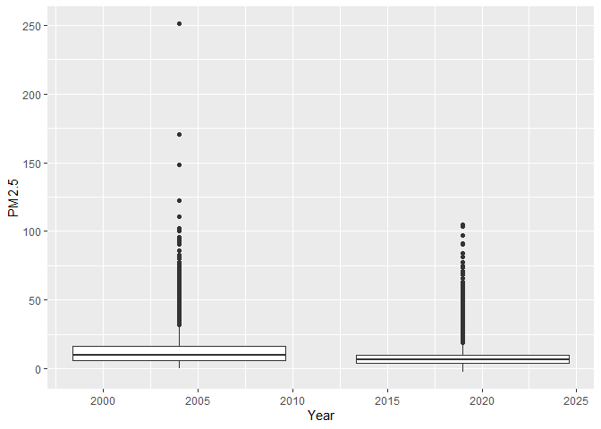

Assignment 01 - Exploratory Data Analysis
================
Tzu Yu Huang
2022-09-24

## 1. Read in the data, packages, and conduct EDA Checklist

``` r
library(webshot) 
library(lubridate)
library(data.table)
library(leaflet)
library(dplyr)
library(ggplot2)
data04 <- data.table::fread("ad_viz_plotval_data_2004.csv")
data19 <- data.table::fread("ad_viz_plotval_data_2019.csv")
```

For each of the two datasets, check the dimensions, headers, footers,
variable names and variable types. Check for any data issues,
particularly in the key variable we are analyzing. Make sure you write
up a summary of all of your findings.

``` r
dim(data04)
```

    ## [1] 19233    20

``` r
head(data04)
```

    ##          Date Source  Site ID POC Daily Mean PM2.5 Concentration    UNITS
    ## 1: 01/01/2004    AQS 60010007   1                           11.0 ug/m3 LC
    ## 2: 01/02/2004    AQS 60010007   1                           12.2 ug/m3 LC
    ## 3: 01/03/2004    AQS 60010007   1                           16.5 ug/m3 LC
    ## 4: 01/04/2004    AQS 60010007   1                           19.5 ug/m3 LC
    ## 5: 01/05/2004    AQS 60010007   1                           11.5 ug/m3 LC
    ## 6: 01/06/2004    AQS 60010007   1                           32.5 ug/m3 LC
    ##    DAILY_AQI_VALUE Site Name DAILY_OBS_COUNT PERCENT_COMPLETE
    ## 1:              46 Livermore               1              100
    ## 2:              51 Livermore               1              100
    ## 3:              60 Livermore               1              100
    ## 4:              67 Livermore               1              100
    ## 5:              48 Livermore               1              100
    ## 6:              94 Livermore               1              100
    ##    AQS_PARAMETER_CODE                     AQS_PARAMETER_DESC CBSA_CODE
    ## 1:              88502 Acceptable PM2.5 AQI & Speciation Mass     41860
    ## 2:              88502 Acceptable PM2.5 AQI & Speciation Mass     41860
    ## 3:              88502 Acceptable PM2.5 AQI & Speciation Mass     41860
    ## 4:              88502 Acceptable PM2.5 AQI & Speciation Mass     41860
    ## 5:              88502 Acceptable PM2.5 AQI & Speciation Mass     41860
    ## 6:              88502 Acceptable PM2.5 AQI & Speciation Mass     41860
    ##                            CBSA_NAME STATE_CODE      STATE COUNTY_CODE  COUNTY
    ## 1: San Francisco-Oakland-Hayward, CA          6 California           1 Alameda
    ## 2: San Francisco-Oakland-Hayward, CA          6 California           1 Alameda
    ## 3: San Francisco-Oakland-Hayward, CA          6 California           1 Alameda
    ## 4: San Francisco-Oakland-Hayward, CA          6 California           1 Alameda
    ## 5: San Francisco-Oakland-Hayward, CA          6 California           1 Alameda
    ## 6: San Francisco-Oakland-Hayward, CA          6 California           1 Alameda
    ##    SITE_LATITUDE SITE_LONGITUDE
    ## 1:      37.68753      -121.7842
    ## 2:      37.68753      -121.7842
    ## 3:      37.68753      -121.7842
    ## 4:      37.68753      -121.7842
    ## 5:      37.68753      -121.7842
    ## 6:      37.68753      -121.7842

``` r
tail(data04)
```

    ##          Date Source  Site ID POC Daily Mean PM2.5 Concentration    UNITS
    ## 1: 12/14/2004    AQS 61131003   1                             11 ug/m3 LC
    ## 2: 12/17/2004    AQS 61131003   1                             16 ug/m3 LC
    ## 3: 12/20/2004    AQS 61131003   1                             17 ug/m3 LC
    ## 4: 12/23/2004    AQS 61131003   1                              9 ug/m3 LC
    ## 5: 12/26/2004    AQS 61131003   1                             24 ug/m3 LC
    ## 6: 12/29/2004    AQS 61131003   1                              9 ug/m3 LC
    ##    DAILY_AQI_VALUE            Site Name DAILY_OBS_COUNT PERCENT_COMPLETE
    ## 1:              46 Woodland-Gibson Road               1              100
    ## 2:              59 Woodland-Gibson Road               1              100
    ## 3:              61 Woodland-Gibson Road               1              100
    ## 4:              38 Woodland-Gibson Road               1              100
    ## 5:              76 Woodland-Gibson Road               1              100
    ## 6:              38 Woodland-Gibson Road               1              100
    ##    AQS_PARAMETER_CODE       AQS_PARAMETER_DESC CBSA_CODE
    ## 1:              88101 PM2.5 - Local Conditions     40900
    ## 2:              88101 PM2.5 - Local Conditions     40900
    ## 3:              88101 PM2.5 - Local Conditions     40900
    ## 4:              88101 PM2.5 - Local Conditions     40900
    ## 5:              88101 PM2.5 - Local Conditions     40900
    ## 6:              88101 PM2.5 - Local Conditions     40900
    ##                                  CBSA_NAME STATE_CODE      STATE COUNTY_CODE
    ## 1: Sacramento--Roseville--Arden-Arcade, CA          6 California         113
    ## 2: Sacramento--Roseville--Arden-Arcade, CA          6 California         113
    ## 3: Sacramento--Roseville--Arden-Arcade, CA          6 California         113
    ## 4: Sacramento--Roseville--Arden-Arcade, CA          6 California         113
    ## 5: Sacramento--Roseville--Arden-Arcade, CA          6 California         113
    ## 6: Sacramento--Roseville--Arden-Arcade, CA          6 California         113
    ##    COUNTY SITE_LATITUDE SITE_LONGITUDE
    ## 1:   Yolo      38.66121      -121.7327
    ## 2:   Yolo      38.66121      -121.7327
    ## 3:   Yolo      38.66121      -121.7327
    ## 4:   Yolo      38.66121      -121.7327
    ## 5:   Yolo      38.66121      -121.7327
    ## 6:   Yolo      38.66121      -121.7327

``` r
str(data04)
```

    ## Classes 'data.table' and 'data.frame':   19233 obs. of  20 variables:
    ##  $ Date                          : chr  "01/01/2004" "01/02/2004" "01/03/2004" "01/04/2004" ...
    ##  $ Source                        : chr  "AQS" "AQS" "AQS" "AQS" ...
    ##  $ Site ID                       : int  60010007 60010007 60010007 60010007 60010007 60010007 60010007 60010007 60010007 60010007 ...
    ##  $ POC                           : int  1 1 1 1 1 1 1 1 1 1 ...
    ##  $ Daily Mean PM2.5 Concentration: num  11 12.2 16.5 19.5 11.5 32.5 15.5 29.9 21 15.7 ...
    ##  $ UNITS                         : chr  "ug/m3 LC" "ug/m3 LC" "ug/m3 LC" "ug/m3 LC" ...
    ##  $ DAILY_AQI_VALUE               : int  46 51 60 67 48 94 58 88 70 59 ...
    ##  $ Site Name                     : chr  "Livermore" "Livermore" "Livermore" "Livermore" ...
    ##  $ DAILY_OBS_COUNT               : int  1 1 1 1 1 1 1 1 1 1 ...
    ##  $ PERCENT_COMPLETE              : num  100 100 100 100 100 100 100 100 100 100 ...
    ##  $ AQS_PARAMETER_CODE            : int  88502 88502 88502 88502 88502 88502 88502 88502 88502 88101 ...
    ##  $ AQS_PARAMETER_DESC            : chr  "Acceptable PM2.5 AQI & Speciation Mass" "Acceptable PM2.5 AQI & Speciation Mass" "Acceptable PM2.5 AQI & Speciation Mass" "Acceptable PM2.5 AQI & Speciation Mass" ...
    ##  $ CBSA_CODE                     : int  41860 41860 41860 41860 41860 41860 41860 41860 41860 41860 ...
    ##  $ CBSA_NAME                     : chr  "San Francisco-Oakland-Hayward, CA" "San Francisco-Oakland-Hayward, CA" "San Francisco-Oakland-Hayward, CA" "San Francisco-Oakland-Hayward, CA" ...
    ##  $ STATE_CODE                    : int  6 6 6 6 6 6 6 6 6 6 ...
    ##  $ STATE                         : chr  "California" "California" "California" "California" ...
    ##  $ COUNTY_CODE                   : int  1 1 1 1 1 1 1 1 1 1 ...
    ##  $ COUNTY                        : chr  "Alameda" "Alameda" "Alameda" "Alameda" ...
    ##  $ SITE_LATITUDE                 : num  37.7 37.7 37.7 37.7 37.7 ...
    ##  $ SITE_LONGITUDE                : num  -122 -122 -122 -122 -122 ...
    ##  - attr(*, ".internal.selfref")=<externalptr>

``` r
dim(data19)
```

    ## [1] 53156    20

``` r
head(data19)
```

    ##          Date Source  Site ID POC Daily Mean PM2.5 Concentration    UNITS
    ## 1: 01/01/2019    AQS 60010007   3                            5.7 ug/m3 LC
    ## 2: 01/02/2019    AQS 60010007   3                           11.9 ug/m3 LC
    ## 3: 01/03/2019    AQS 60010007   3                           20.1 ug/m3 LC
    ## 4: 01/04/2019    AQS 60010007   3                           28.8 ug/m3 LC
    ## 5: 01/05/2019    AQS 60010007   3                           11.2 ug/m3 LC
    ## 6: 01/06/2019    AQS 60010007   3                            2.7 ug/m3 LC
    ##    DAILY_AQI_VALUE Site Name DAILY_OBS_COUNT PERCENT_COMPLETE
    ## 1:              24 Livermore               1              100
    ## 2:              50 Livermore               1              100
    ## 3:              68 Livermore               1              100
    ## 4:              86 Livermore               1              100
    ## 5:              47 Livermore               1              100
    ## 6:              11 Livermore               1              100
    ##    AQS_PARAMETER_CODE       AQS_PARAMETER_DESC CBSA_CODE
    ## 1:              88101 PM2.5 - Local Conditions     41860
    ## 2:              88101 PM2.5 - Local Conditions     41860
    ## 3:              88101 PM2.5 - Local Conditions     41860
    ## 4:              88101 PM2.5 - Local Conditions     41860
    ## 5:              88101 PM2.5 - Local Conditions     41860
    ## 6:              88101 PM2.5 - Local Conditions     41860
    ##                            CBSA_NAME STATE_CODE      STATE COUNTY_CODE  COUNTY
    ## 1: San Francisco-Oakland-Hayward, CA          6 California           1 Alameda
    ## 2: San Francisco-Oakland-Hayward, CA          6 California           1 Alameda
    ## 3: San Francisco-Oakland-Hayward, CA          6 California           1 Alameda
    ## 4: San Francisco-Oakland-Hayward, CA          6 California           1 Alameda
    ## 5: San Francisco-Oakland-Hayward, CA          6 California           1 Alameda
    ## 6: San Francisco-Oakland-Hayward, CA          6 California           1 Alameda
    ##    SITE_LATITUDE SITE_LONGITUDE
    ## 1:      37.68753      -121.7842
    ## 2:      37.68753      -121.7842
    ## 3:      37.68753      -121.7842
    ## 4:      37.68753      -121.7842
    ## 5:      37.68753      -121.7842
    ## 6:      37.68753      -121.7842

``` r
tail(data19)
```

    ##          Date Source  Site ID POC Daily Mean PM2.5 Concentration    UNITS
    ## 1: 11/11/2019    AQS 61131003   1                           13.5 ug/m3 LC
    ## 2: 11/17/2019    AQS 61131003   1                           18.1 ug/m3 LC
    ## 3: 11/29/2019    AQS 61131003   1                           12.5 ug/m3 LC
    ## 4: 12/17/2019    AQS 61131003   1                           23.8 ug/m3 LC
    ## 5: 12/23/2019    AQS 61131003   1                            1.0 ug/m3 LC
    ## 6: 12/29/2019    AQS 61131003   1                            9.1 ug/m3 LC
    ##    DAILY_AQI_VALUE            Site Name DAILY_OBS_COUNT PERCENT_COMPLETE
    ## 1:              54 Woodland-Gibson Road               1              100
    ## 2:              64 Woodland-Gibson Road               1              100
    ## 3:              52 Woodland-Gibson Road               1              100
    ## 4:              76 Woodland-Gibson Road               1              100
    ## 5:               4 Woodland-Gibson Road               1              100
    ## 6:              38 Woodland-Gibson Road               1              100
    ##    AQS_PARAMETER_CODE       AQS_PARAMETER_DESC CBSA_CODE
    ## 1:              88101 PM2.5 - Local Conditions     40900
    ## 2:              88101 PM2.5 - Local Conditions     40900
    ## 3:              88101 PM2.5 - Local Conditions     40900
    ## 4:              88101 PM2.5 - Local Conditions     40900
    ## 5:              88101 PM2.5 - Local Conditions     40900
    ## 6:              88101 PM2.5 - Local Conditions     40900
    ##                                  CBSA_NAME STATE_CODE      STATE COUNTY_CODE
    ## 1: Sacramento--Roseville--Arden-Arcade, CA          6 California         113
    ## 2: Sacramento--Roseville--Arden-Arcade, CA          6 California         113
    ## 3: Sacramento--Roseville--Arden-Arcade, CA          6 California         113
    ## 4: Sacramento--Roseville--Arden-Arcade, CA          6 California         113
    ## 5: Sacramento--Roseville--Arden-Arcade, CA          6 California         113
    ## 6: Sacramento--Roseville--Arden-Arcade, CA          6 California         113
    ##    COUNTY SITE_LATITUDE SITE_LONGITUDE
    ## 1:   Yolo      38.66121      -121.7327
    ## 2:   Yolo      38.66121      -121.7327
    ## 3:   Yolo      38.66121      -121.7327
    ## 4:   Yolo      38.66121      -121.7327
    ## 5:   Yolo      38.66121      -121.7327
    ## 6:   Yolo      38.66121      -121.7327

``` r
str(data19)
```

    ## Classes 'data.table' and 'data.frame':   53156 obs. of  20 variables:
    ##  $ Date                          : chr  "01/01/2019" "01/02/2019" "01/03/2019" "01/04/2019" ...
    ##  $ Source                        : chr  "AQS" "AQS" "AQS" "AQS" ...
    ##  $ Site ID                       : int  60010007 60010007 60010007 60010007 60010007 60010007 60010007 60010007 60010007 60010007 ...
    ##  $ POC                           : int  3 3 3 3 3 3 3 3 3 3 ...
    ##  $ Daily Mean PM2.5 Concentration: num  5.7 11.9 20.1 28.8 11.2 2.7 2.8 7 3.1 7.1 ...
    ##  $ UNITS                         : chr  "ug/m3 LC" "ug/m3 LC" "ug/m3 LC" "ug/m3 LC" ...
    ##  $ DAILY_AQI_VALUE               : int  24 50 68 86 47 11 12 29 13 30 ...
    ##  $ Site Name                     : chr  "Livermore" "Livermore" "Livermore" "Livermore" ...
    ##  $ DAILY_OBS_COUNT               : int  1 1 1 1 1 1 1 1 1 1 ...
    ##  $ PERCENT_COMPLETE              : num  100 100 100 100 100 100 100 100 100 100 ...
    ##  $ AQS_PARAMETER_CODE            : int  88101 88101 88101 88101 88101 88101 88101 88101 88101 88101 ...
    ##  $ AQS_PARAMETER_DESC            : chr  "PM2.5 - Local Conditions" "PM2.5 - Local Conditions" "PM2.5 - Local Conditions" "PM2.5 - Local Conditions" ...
    ##  $ CBSA_CODE                     : int  41860 41860 41860 41860 41860 41860 41860 41860 41860 41860 ...
    ##  $ CBSA_NAME                     : chr  "San Francisco-Oakland-Hayward, CA" "San Francisco-Oakland-Hayward, CA" "San Francisco-Oakland-Hayward, CA" "San Francisco-Oakland-Hayward, CA" ...
    ##  $ STATE_CODE                    : int  6 6 6 6 6 6 6 6 6 6 ...
    ##  $ STATE                         : chr  "California" "California" "California" "California" ...
    ##  $ COUNTY_CODE                   : int  1 1 1 1 1 1 1 1 1 1 ...
    ##  $ COUNTY                        : chr  "Alameda" "Alameda" "Alameda" "Alameda" ...
    ##  $ SITE_LATITUDE                 : num  37.7 37.7 37.7 37.7 37.7 ...
    ##  $ SITE_LONGITUDE                : num  -122 -122 -122 -122 -122 ...
    ##  - attr(*, ".internal.selfref")=<externalptr>

Now I want to check if there’s any missing or improbable value in the
key variables.

``` r
summary(data04$`Daily Mean PM2.5 Concentration`)
```

    ##    Min. 1st Qu.  Median    Mean 3rd Qu.    Max. 
    ##   -0.10    6.00   10.10   13.13   16.30  251.00

``` r
mean(is.na(data04$`Daily Mean PM2.5 Concentration`))
```

    ## [1] 0

``` r
summary(data19$`Daily Mean PM2.5 Concentration`)
```

    ##    Min. 1st Qu.  Median    Mean 3rd Qu.    Max. 
    ##   -2.20    4.00    6.50    7.74    9.90  120.90

``` r
mean(is.na(data19$`Daily Mean PM2.5 Concentration`))
```

    ## [1] 0

``` r
table(data04$STATE)
```

    ## 
    ## California 
    ##      19233

``` r
table(data04$COUNTY)
```

    ## 
    ##         Alameda           Butte       Calaveras          Colusa    Contra Costa 
    ##             458             444              61             201             259 
    ##       Del Norte       El Dorado          Fresno        Humboldt        Imperial 
    ##             117             128             811              58             366 
    ##            Inyo            Kern           Kings            Lake     Los Angeles 
    ##             247            1304              84              60            2243 
    ##           Marin        Mariposa       Mendocino          Merced            Mono 
    ##             120             320              61              90             181 
    ##        Monterey          Nevada          Orange          Placer          Plumas 
    ##              60             232             529             246             258 
    ##       Riverside      Sacramento      San Benito  San Bernardino       San Diego 
    ##            1203            1453             122             893            1431 
    ##   San Francisco     San Joaquin San Luis Obispo       San Mateo   Santa Barbara 
    ##             560             122             176             354             225 
    ##     Santa Clara      Santa Cruz          Shasta        Siskiyou          Solano 
    ##             660              56             181             117             361 
    ##          Sonoma      Stanislaus          Sutter         Trinity          Tulare 
    ##              92             183             309             115             627 
    ##         Ventura            Yolo 
    ##             580             475

``` r
table(data04$`Site ID`)
```

    ## 
    ## 60010007 60011001 60070002 60074001 60090001 60111002 60130002 60150002 
    ##      364       94      122      322       61      201      259      117 
    ## 60170011 60179000 60190008 60195001 60195025 60199000 60231002 60250005 
    ##        9      119      521       90       90      110       58      162 
    ## 60250007 60251003 60270101 60271003 60290010 60290011 60290014 60290015 
    ##       99      105      119      128       88       63      850       96 
    ## 60290016 60299002 60310004 60333001 60370002 60371002 60371103 60371201 
    ##      100      107       84       60      279      109      535      106 
    ## 60371301 60371601 60372005 60374002 60374004 60379033 60379034 60410002 
    ##      115      108      113      325      327      111      115      120 
    ## 60430003 60431001 60450006 60472510 60510001 60519000 60531003 60570005 
    ##      110      210       61       90       59      122       60       56 
    ## 60571001 60590007 60592022 60610006 60631006 60631009 60651003 60652002 
    ##      176      418      111      246       77      181      110      161 
    ## 60655001 60658001 60659000 60670006 60670010 60674001 60690003 60710025 
    ##      112      711      109      414      806      233      122      112 
    ## 60710306 60712002 60718001 60719002 60719004 60719010 60730001 60730003 
    ##      182      199       52      121      106      121      113      438 
    ## 60730006 60731002 60731007 60731011 60750005 60750006 60771002 60792002 
    ##      108      412      337       23      363      197      122       59 
    ## 60798001 60811001 60830011 60831008 60839000 60850005 60852003 60870007 
    ##      117      354       55       58      112      447      213       56 
    ## 60890004 60893003 60893004 60893005 60930005 60950004 60970003 60990005 
    ##       58      110        6        7      117      361       92      183 
    ## 61010003 61059000 61071001 61072002 61110007 61110009 61112002 61113001 
    ##      309      115      112      515      180      111      172      117 
    ## 61130004 61131003 
    ##      359      116

``` r
mean(is.na(data04$STATE))
```

    ## [1] 0

``` r
mean(is.na(data04$COUNTY))
```

    ## [1] 0

``` r
mean(is.na(data04$`Site ID`))
```

    ## [1] 0

``` r
table(data19$STATE)
```

    ## 
    ## California 
    ##      53156

``` r
table(data19$COUNTY)
```

    ## 
    ##         Alameda           Butte       Calaveras          Colusa    Contra Costa 
    ##            2137            1254             338             728             811 
    ##       Del Norte       El Dorado          Fresno           Glenn        Humboldt 
    ##             309             177            2671             356             107 
    ##        Imperial            Inyo            Kern           Kings            Lake 
    ##            1006             902            2084             805              60 
    ##     Los Angeles          Madera           Marin        Mariposa       Mendocino 
    ##            4918             357             457             536             713 
    ##          Merced            Mono        Monterey            Napa          Nevada 
    ##             479             890            1126             355             526 
    ##          Orange          Placer          Plumas       Riverside      Sacramento 
    ##             883            1685             530            4368            2134 
    ##      San Benito  San Bernardino       San Diego   San Francisco     San Joaquin 
    ##             466            2617            2155             359            1307 
    ## San Luis Obispo       San Mateo   Santa Barbara     Santa Clara      Santa Cruz 
    ##            1419             344            1518            1200             697 
    ##          Shasta        Siskiyou          Solano          Sonoma      Stanislaus 
    ##             146             458             716             343             798 
    ##          Sutter          Tehama         Trinity          Tulare         Ventura 
    ##             708             353             345             975            2125 
    ##            Yolo 
    ##             405

``` r
table(data19$`Site ID`)
```

    ## 
    ## 60010007 60010009 60010011 60010012 60010013 60010015 60070008 60072002 
    ##      354      361      357      361      352      352      555      339 
    ## 60074001 60090001 60110007 60111002 60130002 60131004 60150002 60150007 
    ##      360      338      305      423      460      351      114      195 
    ## 60179000 60179001 60190011 60190500 60192008 60192009 60195001 60195025 
    ##       61      116     1118      358      354      341      278      114 
    ## 60199000 60210003 60231004 60250005 60250007 60251003 60270002 60271003 
    ##      108      356      107      773      117      116      416      486 
    ## 60290010 60290011 60290014 60290016 60290018 60292009 60299001 60310004 
    ##      121      365      748      115      360      264      111      456 
    ## 60311004 60333002 60370002 60370016 60371103 60371201 60371302 60371602 
    ##      349       60      121      360      893      480      303      178 
    ## 60372005 60374002 60374004 60374008 60376012 60379033 60379034 60392010 
    ##      175      159      716      711      358      360      104      357 
    ## 60410001 60410002 60430003 60431001 60450006 60452002 60470003 60472510 
    ##      353      104      216      320      359      354      359      120 
    ## 60510001 60510005 60519000 60530002 60530008 60531003 60550004 60570005 
    ##      450      339      101      358      360      408      355      414 
    ## 60571001 60590007 60592022 60610003 60610004 60610006 60611004 60612003 
    ##      112      772      111      353      294      433      301      304 
    ## 60631006 60631010 60650009 60650010 60650012 60650016 60650500 60651016 
    ##      331      199      388      275      365      363      300      392 
    ## 60652002 60655001 60658001 60658005 60659000 60659001 60670006 60670010 
    ##      118      119      833      778       86      351      721      542 
    ## 60670012 60670015 60675003 60690002 60690003 60710005 60710027 60710306 
    ##      399      114      358      356      110      344      710      700 
    ## 60711004 60712002 60718001 60719002 60719004 60719010 60730001 60731006 
    ##      334      175       46      108       98      102      116      350 
    ## 60731008 60731014 60731016 60731017 60731022 60731026 60731201 60750005 
    ##      280      327      174       70      364      121      353      359 
    ## 60771002 60772010 60773005 60792004 60792006 60792007 60798002 60811001 
    ##      682      269      356      361      343      356      359      344 
    ## 60830011 60831008 60832004 60832011 60839000 60850002 60850005 60850006 
    ##      338      359      354      361      106      360      482      358 
    ## 60870007 60871005 60890004 60893003 60930005 60932001 60950004 60970004 
    ##      353      344       53       93      100      358      716      343 
    ## 60990005 60990006 61010003 61030007 61050002 61059000 61071001 61072002 
    ##      438      360      708      353      227      118      110      527 
    ## 61072010 61110007 61110009 61111004 61112002 61113001 61130004 61131003 
    ##      338      358      347      361      715      344      352       53

``` r
mean(is.na(data19$STATE))
```

    ## [1] 0

``` r
mean(is.na(data19$COUNTY))
```

    ## [1] 0

``` r
mean(is.na(data19$`Site ID`))
```

    ## [1] 0

Summary: there are no missing value for variable “Daily Mean PM2.5
Concentration”, “STATE”, “COUNTY”, “Site ID” in the form of NA or 9999
as far as I can see. There is also more site than County, which makes
perfect sense. However, for PM2.5, there are some negative values.
According to
“<https://www.epa.gov/sites/default/files/2016-10/documents/pm2.5_continuous_monitoring.pdf>”,
If the atmosphere is very clean (approaching 0 µg/m3) and there is noise
in the measurement, then a negative number may in fact be valid. And the
proportion of negative values is low,

``` r
mean(data04$`Daily Mean PM2.5 Concentration` < 0)
```

    ## [1] 5.199397e-05

``` r
mean(data19$`Daily Mean PM2.5 Concentration` < 0)
```

    ## [1] 0.00530514

so I’ll ignore this problem for now.

Another problem for “Daily Mean PM2.5 Concentration” is that both
datasets has a max value significantly bigger than the mean. So I took a
closer look at the distribution of the site that generate such value.

``` r
data04[data04$`Daily Mean PM2.5 Concentration` == 251.0,]
```

    ##          Date Source  Site ID POC Daily Mean PM2.5 Concentration    UNITS
    ## 1: 07/18/2004    AQS 60431001   3                            251 ug/m3 LC
    ##    DAILY_AQI_VALUE                                  Site Name DAILY_OBS_COUNT
    ## 1:             301 Yosemite NP-Yosemite Village Vistor Center               1
    ##    PERCENT_COMPLETE AQS_PARAMETER_CODE                     AQS_PARAMETER_DESC
    ## 1:              100              88502 Acceptable PM2.5 AQI & Speciation Mass
    ##    CBSA_CODE CBSA_NAME STATE_CODE      STATE COUNTY_CODE   COUNTY SITE_LATITUDE
    ## 1:        NA                    6 California          43 Mariposa      37.74871
    ##    SITE_LONGITUDE
    ## 1:      -119.5871

``` r
#site ID = 60431001
data19[data19$`Daily Mean PM2.5 Concentration` == 120.90,]
```

    ##          Date Source  Site ID POC Daily Mean PM2.5 Concentration    UNITS
    ## 1: 10/11/2019    AQS 60371201   3                          120.9 ug/m3 LC
    ##    DAILY_AQI_VALUE Site Name DAILY_OBS_COUNT PERCENT_COMPLETE
    ## 1:             185    Reseda               1              100
    ##    AQS_PARAMETER_CODE                     AQS_PARAMETER_DESC CBSA_CODE
    ## 1:              88502 Acceptable PM2.5 AQI & Speciation Mass     31080
    ##                             CBSA_NAME STATE_CODE      STATE COUNTY_CODE
    ## 1: Los Angeles-Long Beach-Anaheim, CA          6 California          37
    ##         COUNTY SITE_LATITUDE SITE_LONGITUDE
    ## 1: Los Angeles      34.19925      -118.5328

``` r
#site ID = 60371201

boxplot(data04[data04$`Site ID` == 60431001, "Daily Mean PM2.5 Concentration"]$`Daily Mean PM2.5 Concentration`)
```

<!-- -->

``` r
boxplot(data19[data19$`Site ID` == 60371201, "Daily Mean PM2.5 Concentration"]$`Daily Mean PM2.5 Concentration`)
```

<!-- -->

For the dataset from 2004, there are other extreme values that are close
to 251, but for the dataset from 2019, all the other values are
significantly further from 120.90, which makes it look very suspicious.
And I will therefore remove it from the dataset.

``` r
data19 <- data19[data19$`Daily Mean PM2.5 Concentration` < 120.90]
```

## Step 2. Combine the two years of data into one data frame. Use the Date variable to create a new column for year, which will serve as an identifier. Change the names of the key variables so that they are easier to refer to in your code.

``` r
data04$Year <- 2004
data19$Year <- 2019

data <- rbind(data04, data19)

colnames(data)[5] <- "PM2.5"
colnames(data)[3] <- "Site_ID"
```

## Step 3. Create a basic map in leaflet() that shows the locations of the sites (make sure to use different colors for each year). Summarize the spatial distribution of the monitoring sites.

``` r
#Extract information of the Site without duplication
Siteinfo <- unique(data[, c("Site_ID", "SITE_LATITUDE", "SITE_LONGITUDE", "Year")])

leaflet() %>% 
  addProviderTiles('CartoDB.Positron') %>% 
  addCircles(data = Siteinfo[Year == 2004], lat = ~SITE_LATITUDE, lng = ~SITE_LONGITUDE, opacity = 0.5, fillOpacity = 1, radius = 400, color = "blue") %>%
  addCircles(data = Siteinfo[Year == 2019], lat = ~SITE_LATITUDE, lng = ~SITE_LONGITUDE, opacity = 0.5, fillOpacity = 1, radius = 400, color = "red")
```

<!-- -->
Semi-transparent blue dots indicate sites in the 2004 data set,
Semi-transparent red dots indicate sites in the 2019 data set, purple
dots represent sites that are contained in both 2004 and 2019 data set.
It seems like a huge portion of the sites exist in both data sets. I can
see a lot of new sites in San Francisco, and one close to Las Vegas
being remove.

## Step 4. Check for any missing or implausible values of PM in the combined dataset. Explore the proportions of each and provide a summary of any temporal patterns you see in these observations.

``` r
nrow(data[Year == 2004])
```

    ## [1] 19233

``` r
nrow(data[Year == 2019])
```

    ## [1] 53155

``` r
nrow(data)
```

    ## [1] 72388

``` r
nrow(data[Year == 2004])/nrow(data)
```

    ## [1] 0.2656932

``` r
nrow(data[Year == 2019])/nrow(data)
```

    ## [1] 0.7343068

``` r
ggplot(data = data) + 
     geom_bar(mapping = aes(x = Year, y = stat(prop), group = 1))
```

<!-- -->

The graph above shows the proportion of data from 2004 and 2019. It
shows that the closer it is to the present, the more data there are,
which makes sense.

We also check the differences in county and sites between the 2 time
periods.

``` r
unique(data[Year== 2004]$COUNTY) %in% unique(data[Year== 2019]$COUNTY) %>% mean()
```

    ## [1] 1

``` r
unique(data[Year== 2004]$Site_ID) %in% unique(data[Year== 2019]$Site_ID) %>% mean()
```

    ## [1] 0.7358491

``` r
unique(data[Year== 2019]$COUNTY) %in% unique(data[Year== 2004]$COUNTY) %>% mean()
```

    ## [1] 0.9215686

``` r
unique(data[Year== 2019]$Site_ID) %in% unique(data[Year== 2004]$Site_ID) %>% mean()
```

    ## [1] 0.4875

So counties that exist in both datasets takes up 100% of the counties
from 2004, and 92% from 2019. And sites that exist in both datasets
takes up 74% of the counties from 2004, and 49% from 2019.

## Step 5. Explore the main question of interest at three different spatial levels. Create exploratory plots (e.g. boxplots, histograms, line plots) and summary statistics that best suit each level of data. Be sure to write up explanations of what you observe in these data.

I first take a look at the distribution of PM2.5 from both time period.

``` r
hist(data[Year == 2004]$PM2.5, 100)
hist(data[Year == 2004]$PM2.5, 100)
```

<!-- -->

Both looks to be pretty right skewed, I’ll mainly use median for the
following analysis. Mean will also be use for sensitivity purposes.

# State level analysis

``` r
data %>% ggplot()+
     geom_boxplot(mapping=aes(x=Year, y= PM2.5, group = Year))
```

<!-- -->

It seems that PM2.5 in 2019 is lower than 2004 from a State wise
perspective.

# County level analysis_datatset_prep

Using information only from counties that exist in both years. To
control for confounding.

``` r
match(unique(data04$COUNTY), unique(data19$COUNTY))
```

    ##  [1]  1  2  3  4  5  6  7  8 10 11 12 13 14 15 16 18 19 20 21 22 23 25 26 27 28
    ## [26] 29 30 31 32 33 34 35 36 37 38 39 40 41 42 43 44 45 46 48 49 50 51

``` r
match(unique(data19$COUNTY), unique(data04$COUNTY))
```

    ##  [1]  1  2  3  4  5  6  7  8 NA  9 10 11 12 13 14 15 NA 16 17 18 19 20 21 NA 22
    ## [26] 23 24 25 26 27 28 29 30 31 32 33 34 35 36 37 38 39 40 41 42 43 NA 44 45 46
    ## [51] 47

``` r
county_median <- group_by(data, Year, COUNTY) %>% summarize(PM2.5 = median(PM2.5, na.rm= TRUE))
```

    ## `summarise()` has grouped output by 'Year'. You can override using the `.groups` argument.

``` r
county_median_both <- county_median[which(county_median$COUNTY %in% unique(data04$COUNTY)),]

head(county_median_both)
```

    ## # A tibble: 6 x 3
    ## # Groups:   Year [1]
    ##    Year COUNTY       PM2.5
    ##   <dbl> <chr>        <dbl>
    ## 1  2004 Alameda        8.6
    ## 2  2004 Butte          7.9
    ## 3  2004 Calaveras      7  
    ## 4  2004 Colusa         7  
    ## 5  2004 Contra Costa   8.6
    ## 6  2004 Del Norte      2.8

``` r
dim(county_median_both)
```

    ## [1] 94  3

``` r
match(unique(data04$COUNTY), unique(data19$COUNTY))
```

    ##  [1]  1  2  3  4  5  6  7  8 10 11 12 13 14 15 16 18 19 20 21 22 23 25 26 27 28
    ## [26] 29 30 31 32 33 34 35 36 37 38 39 40 41 42 43 44 45 46 48 49 50 51

``` r
match(unique(data19$COUNTY), unique(data04$COUNTY))
```

    ##  [1]  1  2  3  4  5  6  7  8 NA  9 10 11 12 13 14 15 NA 16 17 18 19 20 21 NA 22
    ## [26] 23 24 25 26 27 28 29 30 31 32 33 34 35 36 37 38 39 40 41 42 43 NA 44 45 46
    ## [51] 47

``` r
county_mean <- group_by(data, Year, COUNTY) %>% summarize(PM2.5 = mean(PM2.5, na.rm= TRUE))
```

    ## `summarise()` has grouped output by 'Year'. You can override using the `.groups` argument.

``` r
county_mean_both <- county_mean[which(county_mean$COUNTY %in% unique(data04$COUNTY)),]
head(county_mean_both)
```

    ## # A tibble: 6 x 3
    ## # Groups:   Year [1]
    ##    Year COUNTY       PM2.5
    ##   <dbl> <chr>        <dbl>
    ## 1  2004 Alameda      11.0 
    ## 2  2004 Butte        10.1 
    ## 3  2004 Calaveras     7.61
    ## 4  2004 Colusa       10.0 
    ## 5  2004 Contra Costa 12.8 
    ## 6  2004 Del Norte     3.41

``` r
dim(county_mean_both)
```

    ## [1] 94  3

# County level analysis_plot

``` r
qplot(xyear, PM2.5, data = mutate(county_median_both, xyear = as.numeric(as.character(Year))),
       color = factor(COUNTY), 
       geom = c("point", "line"), main = "Change in median PM2.5 levels from 2004 to 2019 by County")
```

<!-- -->

``` r
qplot(xyear, PM2.5, data = mutate(county_mean_both, xyear = as.numeric(as.character(Year))),
       color = factor(COUNTY), 
       geom = c("point", "line"), main = "Change in mean PM2.5 levels from 2004 to 2019 by County")
```

<!-- -->

For both mean and median, the overall trend for the level of PM2.5 from
2019 seems to be lower than 2004.

# Site (in Los Angeles) level analysis_datatset_prep

Using information only from sites that exist in both years. To control
for confounding.

``` r
data <- data[COUNTY == "Los Angeles"]
Site_median <- group_by(data, Year, Site_ID) %>% summarize(PM2.5 = mean(PM2.5, na.rm= TRUE))
```

    ## `summarise()` has grouped output by 'Year'. You can override using the `.groups` argument.

``` r
site_median_both <- Site_median[which(Site_median$Site_ID %in% unique(data04$`Site ID`)),]
head(site_median_both)
```

    ## # A tibble: 6 x 3
    ## # Groups:   Year [1]
    ##    Year  Site_ID PM2.5
    ##   <dbl>    <int> <dbl>
    ## 1  2004 60370002  18.4
    ## 2  2004 60371002  19.2
    ## 3  2004 60371103  20.1
    ## 4  2004 60371201  15.6
    ## 5  2004 60371301  18.5
    ## 6  2004 60371601  19.9

``` r
dim(site_median_both)
```

    ## [1] 19  3

``` r
Site_mean <- group_by(data, Year, Site_ID) %>% summarize(PM2.5 = mean(PM2.5, na.rm= TRUE))
```

    ## `summarise()` has grouped output by 'Year'. You can override using the `.groups` argument.

``` r
site_mean_both <- Site_mean[which(Site_mean$Site_ID %in% unique(data04$`Site ID`)),]
head(site_mean_both)
```

    ## # A tibble: 6 x 3
    ## # Groups:   Year [1]
    ##    Year  Site_ID PM2.5
    ##   <dbl>    <int> <dbl>
    ## 1  2004 60370002  18.4
    ## 2  2004 60371002  19.2
    ## 3  2004 60371103  20.1
    ## 4  2004 60371201  15.6
    ## 5  2004 60371301  18.5
    ## 6  2004 60371601  19.9

``` r
dim(site_mean_both)
```

    ## [1] 19  3

# Site level analysis_plot

``` r
qplot(xyear, PM2.5, data = mutate(site_median_both, xyear = as.numeric(as.character(Year))), 
       color = factor(Site_ID), 
       geom = c("point", "line"), main = "Change in median PM2.5 levels from 2004 to 2019 by Site")
```

<!-- -->

``` r
qplot(xyear, PM2.5, data = mutate(site_mean_both, xyear = as.numeric(as.character(Year))),
       color = factor(Site_ID), 
       geom = c("point", "line"), main = "Change in mean PM2.5 levels from 2004 to 2019 by Site")
```

<!-- -->

For both mean and median, the overall trend for the level of PM2.5 from
2019 seems to be lower than 2004.
