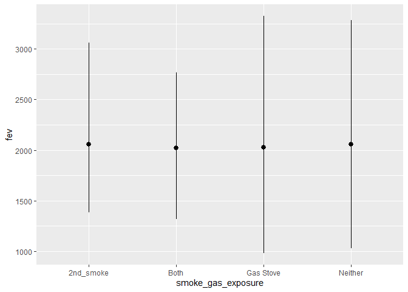
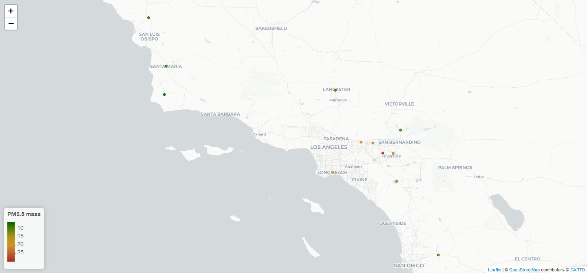

Assignment 2
================
2022-10-06

``` r
library(webshot)
library(tidyverse)
```

    ## -- Attaching packages --------------------------------------- tidyverse 1.3.1 --

    ## v ggplot2 3.3.5     v purrr   0.3.4
    ## v tibble  3.1.4     v dplyr   1.0.7
    ## v tidyr   1.1.3     v stringr 1.4.0
    ## v readr   2.0.1     v forcats 0.5.1

    ## -- Conflicts ------------------------------------------ tidyverse_conflicts() --
    ## x dplyr::filter() masks stats::filter()
    ## x dplyr::lag()    masks stats::lag()

``` r
library(dplyr)
library(ggplot2)
library(data.table)
```

    ## 
    ## 載入套件：'data.table'

    ## 下列物件被遮斷自 'package:dplyr':
    ## 
    ##     between, first, last

    ## 下列物件被遮斷自 'package:purrr':
    ## 
    ##     transpose

``` r
library(leaflet)
```

\#Data Wrangling

## Step 1. Read in the data

First download and then read in with read.csv()

``` r
if (!file.exists("chs_individual.csv")){
     download.file("https://raw.githubusercontent.com/USCbiostats/data-science-data/master/01_chs/chs_individual.csv",
                   "chs_individual.csv", method="libcurl", timeout = 60)
}

if (!file.exists("chs_regional.csv")){
     download.file("https://raw.githubusercontent.com/USCbiostats/data-science-data/master/01_chs/chs_regional.csv",
                   "chs_regional.csv", method="libcurl", timeout = 60)
}

ind <- read.csv("chs_individual.csv")
reg <- read.csv("chs_regional.csv")
str(ind)
```

    ## 'data.frame':    1200 obs. of  23 variables:
    ##  $ sid          : int  1 2 6 7 8 10 13 16 19 21 ...
    ##  $ townname     : chr  "Lancaster" "Lancaster" "Lancaster" "Lancaster" ...
    ##  $ male         : int  1 1 0 0 0 1 1 0 0 0 ...
    ##  $ race         : chr  "W" "W" "B" "O" ...
    ##  $ hispanic     : int  0 0 0 0 1 1 1 0 0 1 ...
    ##  $ agepft       : num  10.15 10.46 10.1 10.75 9.78 ...
    ##  $ height       : int  123 145 145 156 132 NA 140 141 NA 126 ...
    ##  $ weight       : int  54 77 143 72 61 NA 79 74 NA 59 ...
    ##  $ bmi          : num  16.2 16.6 30.9 13.4 15.9 ...
    ##  $ asthma       : int  0 0 0 0 0 0 0 1 0 0 ...
    ##  $ active_asthma: int  0 0 0 0 0 1 0 0 0 0 ...
    ##  $ father_asthma: int  0 0 0 NA 1 1 0 0 0 0 ...
    ##  $ mother_asthma: int  0 0 0 0 0 0 0 1 0 0 ...
    ##  $ wheeze       : int  0 1 0 1 1 0 0 1 0 0 ...
    ##  $ hayfever     : int  0 0 1 0 1 0 0 0 0 0 ...
    ##  $ allergy      : int  0 0 0 0 1 0 0 1 0 1 ...
    ##  $ educ_parent  : int  3 5 2 2 3 1 3 3 3 3 ...
    ##  $ smoke        : int  0 0 0 1 0 0 0 1 0 0 ...
    ##  $ pets         : int  1 1 0 1 1 1 1 1 1 1 ...
    ##  $ gasstove     : int  1 0 1 1 0 1 0 1 1 1 ...
    ##  $ fev          : num  1650 2273 2012 1643 1652 ...
    ##  $ fvc          : num  1800 2721 2257 2061 1996 ...
    ##  $ mmef         : num  2538 2366 1819 1462 1607 ...

``` r
str(reg)
```

    ## 'data.frame':    12 obs. of  27 variables:
    ##  $ townname   : chr  "Alpine" "Lake Elsinore" "Lake Gregory" "Lancaster" ...
    ##  $ pm25_mass  : num  8.74 12.35 7.66 8.5 5.96 ...
    ##  $ pm25_so4   : num  1.73 1.9 1.07 0.91 1.08 3.23 2.69 2.43 2.59 0.79 ...
    ##  $ pm25_no3   : num  1.59 2.98 2.07 1.87 0.73 6.22 12.2 8.66 7.2 1.38 ...
    ##  $ pm25_nh4   : num  0.88 1.36 0.91 0.78 0.41 2.57 4.25 3.14 2.71 0.61 ...
    ##  $ pm25_oc    : num  2.54 3.64 2.46 4.43 1.45 ...
    ##  $ pm25_ec    : num  0.48 0.62 0.4 0.55 0.13 1.36 1.25 0.94 1.17 0.4 ...
    ##  $ pm25_om    : num  3.04 4.36 2.96 5.32 1.74 6.25 14.2 6.32 6.71 3.97 ...
    ##  $ pm10_oc    : num  3.25 4.66 3.16 5.68 1.86 ...
    ##  $ pm10_ec    : num  0.49 0.63 0.41 0.56 0.14 1.39 1.28 0.96 1.19 0.41 ...
    ##  $ pm10_tc    : num  3.75 5.29 3.57 8.61 1.99 ...
    ##  $ formic     : num  1.03 1.18 0.66 0.88 0.34 1.57 1.9 1.72 2.77 0.74 ...
    ##  $ acetic     : num  2.49 3.56 2.36 2.88 0.75 2.94 5.14 3.92 4.24 2.11 ...
    ##  $ hcl        : num  0.41 0.46 0.28 0.22 0.33 0.73 0.46 0.47 0.55 0.31 ...
    ##  $ hno3       : num  1.98 2.63 2.28 1.8 0.43 2.67 3.33 3.43 4.07 0.97 ...
    ##  $ o3_max     : num  65.8 66.7 84.4 54.8 43.9 ...
    ##  $ o3106      : num  55 54.4 67 43.9 37.7 ...
    ##  $ o3_24      : num  41.2 32.2 57.8 32.9 28.4 ...
    ##  $ no2        : num  12.18 17.03 7.62 15.77 4.6 ...
    ##  $ pm10       : num  24.7 34.2 20.1 25 18.4 ...
    ##  $ no_24hr    : num  2.48 7.07 NA 12.68 2.05 ...
    ##  $ pm2_5_fr   : num  10.28 14.53 9.01 NA NA ...
    ##  $ iacid      : num  2.39 3.09 2.56 2.02 0.76 3.4 3.79 3.9 4.62 1.28 ...
    ##  $ oacid      : num  3.52 4.74 3.02 3.76 1.09 4.51 7.04 5.64 7.01 2.85 ...
    ##  $ total_acids: num  5.5 7.37 5.3 5.56 1.52 ...
    ##  $ lon        : num  -117 -117 -117 -118 -120 ...
    ##  $ lat        : num  32.8 33.7 34.2 34.7 34.6 ...

Merge the data

``` r
dat <- merge(
  # Data
  x     = ind,      
  y     = reg, 
  # List of variables to match
  by.x  = "townname",
  by.y  = "townname", 
  # Which obs to keep?
  all.x = TRUE,      
  all.y = TRUE
  )
```

## 1. After merging the data, make sure you don’t have any duplicates by counting the number of rows. Make sure it matches.

``` r
nrow(ind)
```

    ## [1] 1200

``` r
nrow(dat)
```

    ## [1] 1200

It seems that there are no duplicate, the merge was successful.

``` r
dat <- dat %>%
     group_by(male, hispanic) %>%
     mutate(
        bmi_imp = coalesce(bmi, mean(bmi, na.rm = TRUE))
     ) %>% collect()

 # fev 

sum(is.na(dat$bmi))
```

    ## [1] 89

``` r
sum(is.na(dat$bmi_imp))
```

    ## [1] 0

``` r
dat <- as.data.table(dat)

sum(is.na(dat$fev))
```

    ## [1] 95

``` r
dat[, fev := fcoalesce(fev, mean(fev, na.rm = TRUE)),
    by = .(male, hispanic)]

sum(is.na(dat$fev_imp))
```

    ## [1] 0

Now that theres no missing data in bmi_imp and fev.

## 2. Create a new categorical variable named “obesity_level” using the BMI measurement (underweight BMI\<14; normal BMI 14-22; overweight BMI 22-24; obese BMI\>24). To make sure the variable is rightly coded, create a summary table that contains the minimum BMI, maximum BMI, and the total number of observations per category.

``` r
dat <- dat[, obesity_level := fifelse( bmi_imp < 14, "underweight", 
                        fifelse( bmi_imp <= 22, "normal BMI",
                        fifelse( bmi_imp <= 24, "overweight",
                       "obese")))
 ]

bmi_tab <- 
    dat[ , .(
          bmi_min  = min(bmi_imp, na.rm = T),
          bmi_max  = max(bmi_imp, na.rm = T), 
          bmi_num  = length(bmi_imp)
    ), by = obesity_level]
bmi_tab
```

    ##    obesity_level  bmi_min  bmi_max bmi_num
    ## 1:    normal BMI 14.00380 21.96387     975
    ## 2:         obese 24.00647 41.26613     103
    ## 3:    overweight 22.02353 23.99650      87
    ## 4:   underweight 11.29640 13.98601      35

## 3. Create another categorical variable named “smoke_gas_exposure” that summarizes “Second Hand Smoke” and “Gas Stove.” The variable should have four categories in total.

``` r
dat[, smoke_gas_exposure := 
              fifelse( smoke == 1 & gasstove == 1, "Both",
              fifelse( smoke == 1 & gasstove == 0, "2nd_smoke",
              fifelse( smoke == 0 & gasstove == 1, "Gas Stove",
              "Neither")))
 ]

table(dat$smoke_gas_exposure)
```

    ## 
    ## 2nd_smoke      Both Gas Stove   Neither 
    ##        36       151       739       214

``` r
sum(is.na(dat$smoke_gas_exposure))
```

    ## [1] 60

``` r
mean(is.na(dat$smoke_gas_exposure))
```

    ## [1] 0.05

After creating the smoke_gas_exposure, 5% of it is missing value, but
it’s low, so I’ll ignore it for now.

## 4. Create four summary tables showing the average (or proportion, if binary) and sd of “Forced expiratory volume in 1 second (ml)” and asthma indicator by town, sex, obesity level, and “smoke_gas_exposure.”

``` r
dat[ , .(
  fev_mean  = mean(fev, na.rm=T), 
  fev_sd    = sd(fev, na.rm=T), 
  asth_pro  = sum(asthma, na.rm = T)/sum(!is.na(asthma))
), by = townname
]
```

    ##          townname fev_mean   fev_sd  asth_pro
    ##  1:        Alpine 2087.101 291.1768 0.1134021
    ##  2:    Atascadero 2075.897 324.0935 0.2551020
    ##  3: Lake Elsinore 2038.849 303.6956 0.1263158
    ##  4:  Lake Gregory 2084.700 319.9593 0.1515152
    ##  5:     Lancaster 2003.044 317.1298 0.1649485
    ##  6:        Lompoc 2034.354 351.0454 0.1134021
    ##  7:    Long Beach 1985.861 319.4625 0.1354167
    ##  8:     Mira Loma 1985.202 324.9634 0.1578947
    ##  9:     Riverside 1989.881 277.5065 0.1100000
    ## 10:     San Dimas 2026.794 318.7845 0.1717172
    ## 11:   Santa Maria 2025.750 312.1725 0.1340206
    ## 12:        Upland 2024.266 343.1637 0.1212121

``` r
dat[ , .(
  fev_mean  = mean(fev, na.rm=T), 
  fev_sd    = sd(fev, na.rm=T), 
  asth_pro  = sum(asthma, na.rm = T)/sum(!is.na(asthma))
), by = male
]
```

    ##    male fev_mean   fev_sd  asth_pro
    ## 1:    1 2103.787 307.5123 0.1727749
    ## 2:    0 1958.911 311.9181 0.1208054

``` r
dat[ , .(
  fev_mean  = mean(fev, na.rm=T), 
  fev_sd    = sd(fev, na.rm=T), 
  asth_pro  = sum(asthma, na.rm = T)/sum(!is.na(asthma))
), by = obesity_level
]
```

    ##    obesity_level fev_mean   fev_sd   asth_pro
    ## 1:    normal BMI 1999.794 295.1964 0.14014752
    ## 2:         obese 2266.154 325.4710 0.21000000
    ## 3:    overweight 2224.322 317.4261 0.16470588
    ## 4:   underweight 1698.327 303.3983 0.08571429

``` r
dat[!is.na(smoke_gas_exposure)][ , .(
  fev_mean  = mean(fev, na.rm=T), 
  fev_sd    = sd(fev, na.rm=T), 
  asth_pro  = sum(asthma, na.rm = T)/sum(!is.na(asthma))
), by = smoke_gas_exposure
]
```

    ##    smoke_gas_exposure fev_mean   fev_sd  asth_pro
    ## 1:            Neither 2055.356 330.4169 0.1476190
    ## 2:          Gas Stove 2025.989 317.6305 0.1477428
    ## 3:          2nd_smoke 2055.714 295.6475 0.1714286
    ## 4:               Both 2019.867 298.9728 0.1301370

# Looking at the Data (EDA)

check the dimensions, headers, footers, variable names and variable
types. Check for any data issues, particularly in the key variable we
are analyzing.

``` r
dim(dat)
```

    ## [1] 1200   52

``` r
head(dat)
```

    ##    townname sid male race hispanic    agepft height weight      bmi asthma
    ## 1:   Alpine 841    1    W        1 10.548939    150     78 15.75758      0
    ## 2:   Alpine 835    0    W        0 10.099932    143     69 15.33749      0
    ## 3:   Alpine 838    0    O        1  9.486653    133     62 15.93183      0
    ## 4:   Alpine 840    0    W        0  9.965777    146     78 16.63283      0
    ## 5:   Alpine 865    0    W        0 10.039699    162    140 24.24797      1
    ## 6:   Alpine 867    0    W        1  9.957563    141     94 21.49151      0
    ##    active_asthma father_asthma mother_asthma wheeze hayfever allergy
    ## 1:             0             0             0      0        0       0
    ## 2:             0             0             0      0        0       1
    ## 3:             0             0             0      0        0       0
    ## 4:             0             0             0      0        0       0
    ## 5:             1             0             0      1        0       1
    ## 6:             0            NA             0      0        0       0
    ##    educ_parent smoke pets gasstove      fev      fvc     mmef pm25_mass
    ## 1:           5     0    1        0 2251.505 2594.649 2445.151      8.74
    ## 2:           3     0    1        0 2529.276 2826.316 3406.579      8.74
    ## 3:           4    NA    1        0 1737.793 1963.545 2133.110      8.74
    ## 4:          NA    NA    0       NA 2466.791 2638.221 3466.464      8.74
    ## 5:           3     0    1        1 2583.934 3567.541 2071.475      8.74
    ## 6:           5     0    1        1 1973.115 2154.098 2690.164      8.74
    ##    pm25_so4 pm25_no3 pm25_nh4 pm25_oc pm25_ec pm25_om pm10_oc pm10_ec pm10_tc
    ## 1:     1.73     1.59     0.88    2.54    0.48    3.04    3.25    0.49    3.75
    ## 2:     1.73     1.59     0.88    2.54    0.48    3.04    3.25    0.49    3.75
    ## 3:     1.73     1.59     0.88    2.54    0.48    3.04    3.25    0.49    3.75
    ## 4:     1.73     1.59     0.88    2.54    0.48    3.04    3.25    0.49    3.75
    ## 5:     1.73     1.59     0.88    2.54    0.48    3.04    3.25    0.49    3.75
    ## 6:     1.73     1.59     0.88    2.54    0.48    3.04    3.25    0.49    3.75
    ##    formic acetic  hcl hno3 o3_max o3106 o3_24   no2  pm10 no_24hr pm2_5_fr
    ## 1:   1.03   2.49 0.41 1.98  65.82 55.05 41.23 12.18 24.73    2.48    10.28
    ## 2:   1.03   2.49 0.41 1.98  65.82 55.05 41.23 12.18 24.73    2.48    10.28
    ## 3:   1.03   2.49 0.41 1.98  65.82 55.05 41.23 12.18 24.73    2.48    10.28
    ## 4:   1.03   2.49 0.41 1.98  65.82 55.05 41.23 12.18 24.73    2.48    10.28
    ## 5:   1.03   2.49 0.41 1.98  65.82 55.05 41.23 12.18 24.73    2.48    10.28
    ## 6:   1.03   2.49 0.41 1.98  65.82 55.05 41.23 12.18 24.73    2.48    10.28
    ##    iacid oacid total_acids       lon      lat  bmi_imp obesity_level
    ## 1:  2.39  3.52         5.5 -116.7664 32.83505 15.75758    normal BMI
    ## 2:  2.39  3.52         5.5 -116.7664 32.83505 15.33749    normal BMI
    ## 3:  2.39  3.52         5.5 -116.7664 32.83505 15.93183    normal BMI
    ## 4:  2.39  3.52         5.5 -116.7664 32.83505 16.63283    normal BMI
    ## 5:  2.39  3.52         5.5 -116.7664 32.83505 24.24797         obese
    ## 6:  2.39  3.52         5.5 -116.7664 32.83505 21.49151    normal BMI
    ##    smoke_gas_exposure
    ## 1:            Neither
    ## 2:            Neither
    ## 3:               <NA>
    ## 4:               <NA>
    ## 5:          Gas Stove
    ## 6:          Gas Stove

``` r
tail(dat)
```

    ##    townname  sid male race hispanic    agepft height weight      bmi asthma
    ## 1:   Upland 1866    0    O        1  9.806982    139     60 14.11559      0
    ## 2:   Upland 1867    0    M        1  9.618070    140     71 16.46568      0
    ## 3:   Upland 2033    0    M        0 10.121834    130     67 18.02044      0
    ## 4:   Upland 2031    1    W        0  9.798768    135     83 20.70084      0
    ## 5:   Upland 2032    1    W        0  9.549624    137     59 14.28855      0
    ## 6:   Upland 2053    0    W        0        NA     NA     NA       NA      0
    ##    active_asthma father_asthma mother_asthma wheeze hayfever allergy
    ## 1:             0            NA             0      0       NA      NA
    ## 2:             0             1             0      0        0       0
    ## 3:             1             0             0      1        1       0
    ## 4:             0             0             0      1        0       1
    ## 5:             0             0             1      1        1       1
    ## 6:             0             0             0      0        0       0
    ##    educ_parent smoke pets gasstove      fev      fvc     mmef pm25_mass
    ## 1:           3     0    1        0 1691.275 1928.859 1890.604     22.46
    ## 2:           3     0    1        0 1733.338 1993.040 2072.643     22.46
    ## 3:           3     0    1        1 1929.866 2122.148 2558.054     22.46
    ## 4:           3     0    1        1 2034.177 2505.535 1814.075     22.46
    ## 5:           3     0    1        1 2077.703 2275.338 2706.081     22.46
    ## 6:           3     0    1        0 1945.743       NA       NA     22.46
    ##    pm25_so4 pm25_no3 pm25_nh4 pm25_oc pm25_ec pm25_om pm10_oc pm10_ec pm10_tc
    ## 1:     2.65     7.75     2.96    6.49    1.19    7.79    8.32    1.22    9.54
    ## 2:     2.65     7.75     2.96    6.49    1.19    7.79    8.32    1.22    9.54
    ## 3:     2.65     7.75     2.96    6.49    1.19    7.79    8.32    1.22    9.54
    ## 4:     2.65     7.75     2.96    6.49    1.19    7.79    8.32    1.22    9.54
    ## 5:     2.65     7.75     2.96    6.49    1.19    7.79    8.32    1.22    9.54
    ## 6:     2.65     7.75     2.96    6.49    1.19    7.79    8.32    1.22    9.54
    ##    formic acetic  hcl hno3 o3_max o3106 o3_24   no2 pm10 no_24hr pm2_5_fr iacid
    ## 1:   2.67   4.73 0.46 4.03  63.83  46.5  22.2 37.97 40.8   18.48    27.73  4.49
    ## 2:   2.67   4.73 0.46 4.03  63.83  46.5  22.2 37.97 40.8   18.48    27.73  4.49
    ## 3:   2.67   4.73 0.46 4.03  63.83  46.5  22.2 37.97 40.8   18.48    27.73  4.49
    ## 4:   2.67   4.73 0.46 4.03  63.83  46.5  22.2 37.97 40.8   18.48    27.73  4.49
    ## 5:   2.67   4.73 0.46 4.03  63.83  46.5  22.2 37.97 40.8   18.48    27.73  4.49
    ## 6:   2.67   4.73 0.46 4.03  63.83  46.5  22.2 37.97 40.8   18.48    27.73  4.49
    ##    oacid total_acids       lon      lat  bmi_imp obesity_level
    ## 1:   7.4       11.43 -117.6484 34.09751 14.11559    normal BMI
    ## 2:   7.4       11.43 -117.6484 34.09751 16.46568    normal BMI
    ## 3:   7.4       11.43 -117.6484 34.09751 18.02044    normal BMI
    ## 4:   7.4       11.43 -117.6484 34.09751 20.70084    normal BMI
    ## 5:   7.4       11.43 -117.6484 34.09751 14.28855    normal BMI
    ## 6:   7.4       11.43 -117.6484 34.09751 18.05281    normal BMI
    ##    smoke_gas_exposure
    ## 1:            Neither
    ## 2:            Neither
    ## 3:          Gas Stove
    ## 4:          Gas Stove
    ## 5:          Gas Stove
    ## 6:            Neither

``` r
str(dat)
```

    ## Classes 'data.table' and 'data.frame':   1200 obs. of  52 variables:
    ##  $ townname          : chr  "Alpine" "Alpine" "Alpine" "Alpine" ...
    ##  $ sid               : int  841 835 838 840 865 867 842 839 844 847 ...
    ##  $ male              : int  1 0 0 0 0 0 1 0 1 1 ...
    ##  $ race              : chr  "W" "W" "O" "W" ...
    ##  $ hispanic          : int  1 0 1 0 0 1 1 1 1 0 ...
    ##  $ agepft            : num  10.55 10.1 9.49 9.97 10.04 ...
    ##  $ height            : int  150 143 133 146 162 141 139 142 143 137 ...
    ##  $ weight            : int  78 69 62 78 140 94 65 86 65 69 ...
    ##  $ bmi               : num  15.8 15.3 15.9 16.6 24.2 ...
    ##  $ asthma            : int  0 0 0 0 1 0 0 0 NA 0 ...
    ##  $ active_asthma     : int  0 0 0 0 1 0 0 0 0 0 ...
    ##  $ father_asthma     : int  0 0 0 0 0 NA 0 0 NA 0 ...
    ##  $ mother_asthma     : int  0 0 0 0 0 0 0 1 NA 0 ...
    ##  $ wheeze            : int  0 0 0 0 1 0 1 1 NA 0 ...
    ##  $ hayfever          : int  0 0 0 0 0 0 0 1 NA 0 ...
    ##  $ allergy           : int  0 1 0 0 1 0 0 1 NA 0 ...
    ##  $ educ_parent       : int  5 3 4 NA 3 5 1 3 NA 5 ...
    ##  $ smoke             : int  0 0 NA NA 0 0 1 1 NA 0 ...
    ##  $ pets              : int  1 1 1 0 1 1 1 1 0 1 ...
    ##  $ gasstove          : int  0 0 0 NA 1 1 0 0 NA 1 ...
    ##  $ fev               : num  2252 2529 1738 2467 2584 ...
    ##  $ fvc               : num  2595 2826 1964 2638 3568 ...
    ##  $ mmef              : num  2445 3407 2133 3466 2071 ...
    ##  $ pm25_mass         : num  8.74 8.74 8.74 8.74 8.74 8.74 8.74 8.74 8.74 8.74 ...
    ##  $ pm25_so4          : num  1.73 1.73 1.73 1.73 1.73 1.73 1.73 1.73 1.73 1.73 ...
    ##  $ pm25_no3          : num  1.59 1.59 1.59 1.59 1.59 1.59 1.59 1.59 1.59 1.59 ...
    ##  $ pm25_nh4          : num  0.88 0.88 0.88 0.88 0.88 0.88 0.88 0.88 0.88 0.88 ...
    ##  $ pm25_oc           : num  2.54 2.54 2.54 2.54 2.54 2.54 2.54 2.54 2.54 2.54 ...
    ##  $ pm25_ec           : num  0.48 0.48 0.48 0.48 0.48 0.48 0.48 0.48 0.48 0.48 ...
    ##  $ pm25_om           : num  3.04 3.04 3.04 3.04 3.04 3.04 3.04 3.04 3.04 3.04 ...
    ##  $ pm10_oc           : num  3.25 3.25 3.25 3.25 3.25 3.25 3.25 3.25 3.25 3.25 ...
    ##  $ pm10_ec           : num  0.49 0.49 0.49 0.49 0.49 0.49 0.49 0.49 0.49 0.49 ...
    ##  $ pm10_tc           : num  3.75 3.75 3.75 3.75 3.75 3.75 3.75 3.75 3.75 3.75 ...
    ##  $ formic            : num  1.03 1.03 1.03 1.03 1.03 1.03 1.03 1.03 1.03 1.03 ...
    ##  $ acetic            : num  2.49 2.49 2.49 2.49 2.49 2.49 2.49 2.49 2.49 2.49 ...
    ##  $ hcl               : num  0.41 0.41 0.41 0.41 0.41 0.41 0.41 0.41 0.41 0.41 ...
    ##  $ hno3              : num  1.98 1.98 1.98 1.98 1.98 1.98 1.98 1.98 1.98 1.98 ...
    ##  $ o3_max            : num  65.8 65.8 65.8 65.8 65.8 ...
    ##  $ o3106             : num  55 55 55 55 55 ...
    ##  $ o3_24             : num  41.2 41.2 41.2 41.2 41.2 ...
    ##  $ no2               : num  12.2 12.2 12.2 12.2 12.2 ...
    ##  $ pm10              : num  24.7 24.7 24.7 24.7 24.7 ...
    ##  $ no_24hr           : num  2.48 2.48 2.48 2.48 2.48 2.48 2.48 2.48 2.48 2.48 ...
    ##  $ pm2_5_fr          : num  10.3 10.3 10.3 10.3 10.3 ...
    ##  $ iacid             : num  2.39 2.39 2.39 2.39 2.39 2.39 2.39 2.39 2.39 2.39 ...
    ##  $ oacid             : num  3.52 3.52 3.52 3.52 3.52 3.52 3.52 3.52 3.52 3.52 ...
    ##  $ total_acids       : num  5.5 5.5 5.5 5.5 5.5 5.5 5.5 5.5 5.5 5.5 ...
    ##  $ lon               : num  -117 -117 -117 -117 -117 ...
    ##  $ lat               : num  32.8 32.8 32.8 32.8 32.8 ...
    ##  $ bmi_imp           : num  15.8 15.3 15.9 16.6 24.2 ...
    ##  $ obesity_level     : chr  "normal BMI" "normal BMI" "normal BMI" "normal BMI" ...
    ##  $ smoke_gas_exposure: chr  "Neither" "Neither" NA NA ...
    ##  - attr(*, "groups")= tibble [4 x 3] (S3: tbl_df/tbl/data.frame)
    ##   ..$ male    : int [1:4] 0 0 1 1
    ##   ..$ hispanic: int [1:4] 0 1 0 1
    ##   ..$ .rows   : list<int> [1:4] 
    ##   .. ..$ : int [1:355] 2 4 5 15 23 27 29 30 33 37 ...
    ##   .. ..$ : int [1:255] 3 6 8 31 43 48 49 51 52 57 ...
    ##   .. ..$ : int [1:324] 10 11 12 14 16 17 18 20 21 22 ...
    ##   .. ..$ : int [1:266] 1 7 9 13 19 26 32 34 35 36 ...
    ##   .. ..@ ptype: int(0) 
    ##   ..- attr(*, ".drop")= logi TRUE
    ##  - attr(*, ".internal.selfref")=<externalptr>

Now check if there’s any missing or improbable value in the key
variables.

``` r
summary(dat$bmi_imp)
```

    ##    Min. 1st Qu.  Median    Mean 3rd Qu.    Max. 
    ##   11.30   15.96   17.81   18.50   19.99   41.27

``` r
summary(dat$fev)
```

    ##    Min. 1st Qu.  Median    Mean 3rd Qu.    Max. 
    ##   984.8  1827.6  2016.4  2030.1  2223.6  3323.7

``` r
table(dat$smoke_gas_exposure)
```

    ## 
    ## 2nd_smoke      Both Gas Stove   Neither 
    ##        36       151       739       214

``` r
mean(is.na(dat$smoke_gas_exposure))
```

    ## [1] 0.05

``` r
summary(dat$pm25_mass)
```

    ##    Min. 1st Qu.  Median    Mean 3rd Qu.    Max. 
    ##   5.960   7.615  10.545  14.362  20.988  29.970

``` r
mean(is.na(dat$pm25_mass))
```

    ## [1] 0

``` r
table(dat$townname)
```

    ## 
    ##        Alpine    Atascadero Lake Elsinore  Lake Gregory     Lancaster 
    ##           100           100           100           100           100 
    ##        Lompoc    Long Beach     Mira Loma     Riverside     San Dimas 
    ##           100           100           100           100           100 
    ##   Santa Maria        Upland 
    ##           100           100

``` r
mean(is.na(dat$townname))
```

    ## [1] 0

There are no missing value for variable “bmi_imp”, “fev”, “pm25_mass”,
“townname” in the form of NA or 9999 as far as I can see. Like
previously shown, only smoke_gas_exposure has missing value, so I’ll
ignore this for now. And no value looks especially abnormal here.

## 1. Facet plot showing scatterplots with regression lines of BMI vs FEV by “townname”.

``` r
dat[!is.na(fev)] %>%
  ggplot(mapping = aes(x = bmi_imp, y = fev, color = townname)) +
  geom_point() + 
  geom_smooth(method = lm, se = FALSE, col = "black")+
  facet_wrap(~ townname)
```

    ## `geom_smooth()` using formula 'y ~ x'

<!-- -->

It does seem like there is association between BMI and FEV (forced
expiratory volume) adjusted by “townname”.

## 2. Stacked histograms of FEV by BMI category and FEV by smoke/gas exposure. Use different color schemes than the ggplot default.

``` r
ggplot(dat) + 
  geom_histogram(mapping = aes(x = fev , fill = obesity_level))
```

    ## `stat_bin()` using `bins = 30`. Pick better value with `binwidth`.

<!-- -->

It appears that category “normal BMI” has the most amount of individual,
which make sense. The peak for “underweight” group seems a bit more left
than the others in terms of fev (the X axis), while the peak of
“overweight” and “obese” groups are a bit hard to extinguish.

``` r
ggplot(dat[!is.na(fev) & !is.na(smoke_gas_exposure)]) + 
  geom_histogram(mapping = aes(x = fev , fill = smoke_gas_exposure))
```

    ## `stat_bin()` using `bins = 30`. Pick better value with `binwidth`.

<!-- -->

In comparison to FEV by BMI category, its a bit harder to tell the peak
apart with FEV by smoke/gas exposure, but “neither” group does seem to
be slightly more on the right, which also make sense.

## 3. Barchart of BMI by smoke/gas exposure.

``` r
dat[!is.na(smoke_gas_exposure)] %>%
  ggplot() + 
  geom_bar(mapping = aes(x = obesity_level, fill= obesity_level)) +
  facet_wrap(~smoke_gas_exposure)
```

<!-- -->

## 4. Statistical summary graphs of FEV by BMI and FEV by smoke/gas exposure category.

``` r
dat[!is.na(fev)] %>%
  ggplot()+
  geom_boxplot(mapping = aes(x= obesity_level, y= fev, fill = obesity_level))
```

<!-- -->

``` r
dat %>%
  ggplot() + 
    stat_summary(mapping = aes(x = obesity_level, y = fev),
    fun.min = min,
    fun.max = max,
    fun = median)
```

<!-- --> It
agrees with the conlcusion made before from the stacked histogram, while
“obese”, “overweight” group seems to have fev distributed higher than
“normal bmi”, and “underweight” seems to have the fev distributed the
lowest.

``` r
dat[!is.na(fev) & !is.na(smoke_gas_exposure)] %>%
  ggplot()+
  geom_boxplot(mapping = aes(x= smoke_gas_exposure, y= fev, fill = smoke_gas_exposure))
```

<!-- -->

``` r
dat[!is.na(smoke_gas_exposure)] %>%
  ggplot() + 
    stat_summary(mapping = aes(x = smoke_gas_exposure, y = fev),
    fun.min = min,
    fun.max = max,
    fun = mean)
```

<!-- -->

This time all four groups are a bit hard to extinguish, which is bit
surprising.

## 5. A leaflet map showing the concentrations of PM2.5 mass in each of the CHS communities.

``` r
pm2.5.pal <- colorNumeric(c('darkgreen','goldenrod','brown'), domain= reg$pm25_mass)
pm2.5.pal
```

    ## function (x) 
    ## {
    ##     if (length(x) == 0 || all(is.na(x))) {
    ##         return(pf(x))
    ##     }
    ##     if (is.null(rng)) 
    ##         rng <- range(x, na.rm = TRUE)
    ##     rescaled <- scales::rescale(x, from = rng)
    ##     if (any(rescaled < 0 | rescaled > 1, na.rm = TRUE)) 
    ##         warning("Some values were outside the color scale and will be treated as NA")
    ##     if (reverse) {
    ##         rescaled <- 1 - rescaled
    ##     }
    ##     pf(rescaled)
    ## }
    ## <bytecode: 0x000000002f30ec88>
    ## <environment: 0x000000002f316540>
    ## attr(,"colorType")
    ## [1] "numeric"
    ## attr(,"colorArgs")
    ## attr(,"colorArgs")$na.color
    ## [1] "#808080"

``` r
leaflet(reg) %>% 
  # The looks of the Map
  addProviderTiles('CartoDB.Positron') %>% 
  # Some circles
  addCircles(
    lat = ~lat, lng=~lon,
                                                  # HERE IS OUR PAL!
    label = ~round(pm25_mass,2), color = ~ pm2.5.pal(pm25_mass),
    opacity = 1, fillOpacity = 1, radius = 500
    ) %>%
  # And a pretty legend
  addLegend('bottomleft', pal= pm2.5.pal, values= reg$pm25_mass,
          title='PM2.5 mass', opacity=1)
```

<!-- -->

## 6. Choose a visualization to examine whether PM2.5 mass is associated with FEV.

``` r
dat[!is.na(fev) & !is.na(pm25_mass)] %>%
  ggplot(mapping = aes(x = pm25_mass, y = fev), position = "jitter") +
  geom_point() + 
  geom_smooth(method = lm, se = FALSE, col = "black")
```

    ## `geom_smooth()` using formula 'y ~ x'

<!-- -->

PM2.5 mass doesn’t seem to be very associated with FEV, but since we
have also been looking at the impact of bmi amd smoke_gas_exposure, I
would like to see if these two are possible confounders, so I draw two
more plots adjusted for those two variables.

``` r
dat[!is.na(fev) & !is.na(pm25_mass)] %>%
  ggplot(mapping = aes(x = pm25_mass, y = fev), position = "jitter") +
  geom_point() + 
  geom_smooth(method = lm, se = FALSE, col = "black") +
  facet_wrap(~obesity_level)
```

    ## `geom_smooth()` using formula 'y ~ x'

<!-- -->

``` r
dat[!is.na(fev) & !is.na(pm25_mass) & !is.na(smoke_gas_exposure)] %>%
  ggplot(mapping = aes(x = pm25_mass, y = fev), position = "jitter") +
  geom_point() + 
  geom_smooth(method = lm, se = FALSE, col = "black") +
  facet_wrap(~smoke_gas_exposure)
```

    ## `geom_smooth()` using formula 'y ~ x'

<!-- -->

Even with controlling for these two additional variables, PM2.5 mass
still doesn’t seem to be very associated with FEV.
