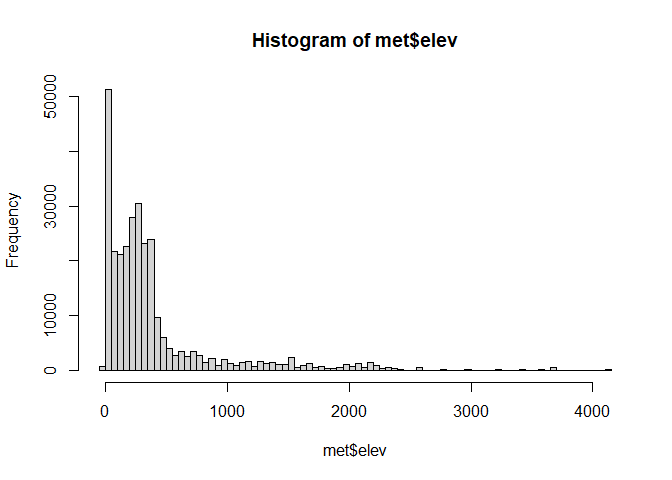
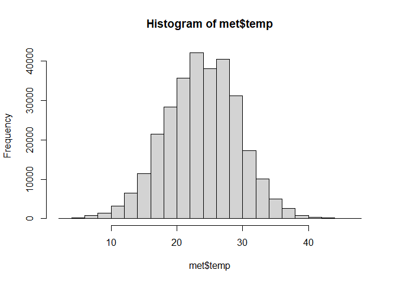
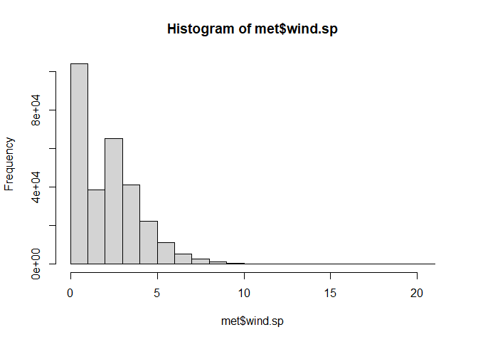

Lab 04
================
2022-09-14

``` r
library(lubridate)
```

    ## 
    ## 載入套件：'lubridate'

    ## 下列物件被遮斷自 'package:base':
    ## 
    ##     date, intersect, setdiff, union

``` r
library(tidyverse)
```

    ## -- Attaching packages --------------------------------------- tidyverse 1.3.1 --

    ## v ggplot2 3.3.5     v purrr   0.3.4
    ## v tibble  3.1.4     v dplyr   1.0.7
    ## v tidyr   1.1.3     v stringr 1.4.0
    ## v readr   2.0.1     v forcats 0.5.1

    ## -- Conflicts ------------------------------------------ tidyverse_conflicts() --
    ## x lubridate::as.difftime() masks base::as.difftime()
    ## x lubridate::date()        masks base::date()
    ## x dplyr::filter()          masks stats::filter()
    ## x lubridate::intersect()   masks base::intersect()
    ## x dplyr::lag()             masks stats::lag()
    ## x lubridate::setdiff()     masks base::setdiff()
    ## x lubridate::union()       masks base::union()

``` r
library(data.table)
```

    ## 
    ## 載入套件：'data.table'

    ## 下列物件被遮斷自 'package:dplyr':
    ## 
    ##     between, first, last

    ## 下列物件被遮斷自 'package:purrr':
    ## 
    ##     transpose

    ## 下列物件被遮斷自 'package:lubridate':
    ## 
    ##     hour, isoweek, mday, minute, month, quarter, second, wday, week,
    ##     yday, year

## Step 1. Read in the data

First download and then read in with data.table:fread()

``` r
if (!file.exists("met_all.gz")){
  download.file("https://raw.githubusercontent.com/USCbiostats/data-science-data/master/02_met/met_all.gz", "met_all.gz", method="libcurl", timeout = 60)
}

met <- data.table::fread("met_all.gz")
```

## 2. Prepare the data

Remove temperatures less than -17C and change elev 9999 to missing value
code.

``` r
met <- met[met$temp >= -17][elev == 9999.0, elev:= NA]
```

Generate a date variable using the functions as.Date() (hint: You will
need the following to create a date paste(year, month, day, sep = “-”)).

``` r
met <- met[, ymd := as.Date(paste(year, month, day, sep = "-"))]
```

Using the data.table::week function, keep the observations of the first
week of the month.

``` r
met[, table(week(ymd))]
```

    ## 
    ##     31     32     33     34     35 
    ## 297260 521605 527924 523847 446576

``` r
met <- met[week(ymd)==31]
```

Compute the mean by station of the variables temp, rh, wind.sp,
vis.dist, dew.point, lat, lon, and elev.

``` r
met[ , .(
  temp      = max(temp),
  rh        = max(rh, na.rm=T), 
  wind.sp   = max(wind.sp, na.rm=T), 
  vis.dist  = max(vis.dist, na.rm=T), 
  dew.point = max(dew.point, na.rm=T), 
  lat       = max(lat, na.rm=T), 
  lon       = max(lon, na.rm=T), 
  elev      = max(elev, na.rm=T)
)]
```

    ##    temp  rh wind.sp vis.dist dew.point    lat     lon elev
    ## 1:   47 100    20.6   144841        29 48.941 -68.313 4113

``` r
met_avg <- met[ , .(
  temp      = mean(temp),
  rh        = mean(rh, na.rm=T), 
  wind.sp   = mean(wind.sp, na.rm=T), 
  vis.dist  = mean(vis.dist, na.rm=T), 
  dew.point = mean(dew.point, na.rm=T), 
  lat       = mean(lat, na.rm=T), 
  lon       = mean(lon, na.rm=T), 
  elev      = mean(elev, na.rm=T)
), by = "USAFID"]
```

Create a region variable for NW, SW, NE, SE based on lon = -98.00 and
lat = 39.71 degrees Create a categorical variable for elevation as in
the lecture slides \## Step 2. Check the dimensions, headers, footers.
How many columns, rows are there?

## Replace elevations with 9999 as NA.

``` r
met[met$elev==9999.0] <- NA
met[, summary(elev)]
```

    ##    Min. 1st Qu.  Median    Mean 3rd Qu.    Max.    NA's 
    ##   -12.0   101.0   254.0   415.7   401.0  4113.0      25

The weather station with the highest elevation is at 4113 meters.

``` r
met <- met[temp>-40]
met2 <- met[order(temp)]
head(met2)
```

    ##    USAFID  WBAN year month day hour min    lat      lon elev wind.dir
    ## 1: 722817  3068 2019     8   1    1   6 38.767 -104.300 1838      180
    ## 2: 725846 93201 2019     8   1   12  15 39.320 -120.139 1798       NA
    ## 3: 725846 93201 2019     8   1   12  55 39.320 -120.140 1798       NA
    ## 4: 725846 93201 2019     8   1   13  15 39.320 -120.139 1798       NA
    ## 5: 725846 93201 2019     8   2   12  55 39.320 -120.139 1798       NA
    ## 6: 725846 93201 2019     8   2   13  15 39.320 -120.139 1798       NA
    ##    wind.dir.qc wind.type.code wind.sp wind.sp.qc ceiling.ht ceiling.ht.qc
    ## 1:           5              N     5.1          5         NA             9
    ## 2:           9              C     0.0          5      22000             5
    ## 3:           9              C     0.0          1      22000             1
    ## 4:           9              C     0.0          5      22000             5
    ## 5:           9              C     0.0          5      22000             5
    ## 6:           9              C     0.0          5      22000             5
    ##    ceiling.ht.method sky.cond vis.dist vis.dist.qc vis.var vis.var.qc temp
    ## 1:                 9        N       NA           9       N          5  -17
    ## 2:                 9        N    16093           5       N          5    2
    ## 3:                 9        N    16093           1       9          9    2
    ## 4:                 9        N    16093           5       N          5    2
    ## 5:                 9        N    16093           5       N          5    2
    ## 6:                 9        N    16093           5       N          5    2
    ##    temp.qc dew.point dew.point.qc atm.press atm.press.qc        rh        ymd
    ## 1:       5        NA            9        NA            9        NA 2019-08-01
    ## 2:       5         1            5        NA            9  93.18257 2019-08-01
    ## 3:       1         2            1        NA            9 100.00000 2019-08-01
    ## 4:       5         1            5        NA            9  93.18257 2019-08-01
    ## 5:       C         0            C        NA            9  86.77534 2019-08-02
    ## 6:       5         0            5        NA            9  86.77534 2019-08-02

``` r
met <- met[temp>-15][order(temp)]
```

## Step 5. Check the data against an external data source.

## Step 6. Calculate summary statistics

``` r
met[elev==max(elev, na.rm=TRUE), summary(wind.sp)]
```

    ##    Min. 1st Qu.  Median    Mean 3rd Qu.    Max.    NA's 
    ##   0.000   2.600   4.600   4.916   6.700  11.800      26

``` r
met[elev==max(elev, na.rm=TRUE), summary(temp)]
```

    ##    Min. 1st Qu.  Median    Mean 3rd Qu.    Max. 
    ##   5.000   6.000   8.000   8.233  10.000  13.000

``` r
met[elev==max(elev, na.rm=TRUE), .(
  temp_wind    = cor(temp, wind.sp, use= "complete"),
  temp_hour    = cor(temp, hour,    use ="complete"),
  wind.sp_day  = cor(wind.sp,day,   use ="complete"),
  wind.sp_hour = cor(wind.sp, hour, use ="complete")
)]
```

    ##     temp_wind temp_hour wind.sp_day wind.sp_hour
    ## 1: -0.4462032 0.4295917  -0.2081152   -0.3303297

## Step 7. Exploratory graphs

``` r
hist(met$elev, breaks=100)
```

<!-- -->

``` r
hist(met$temp)
```

<!-- -->

``` r
hist(met$wind.sp)
```

<!-- -->

``` r
library(leaflet)
library(dplyr)
library(tidyverse)
elev <- met[elev==max(elev)]
```

``` r
#leaflet(elev) %>%
#  addProviderTiles('OpenStreetMap') %>% 
#  addCircles(lat=~lat,lng=~lon, opacity=1, fillOpacity=1, radius=100)
```
