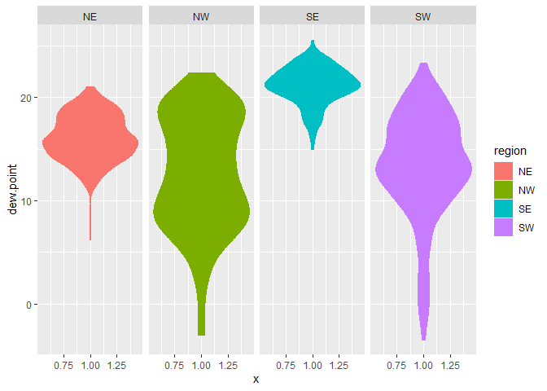
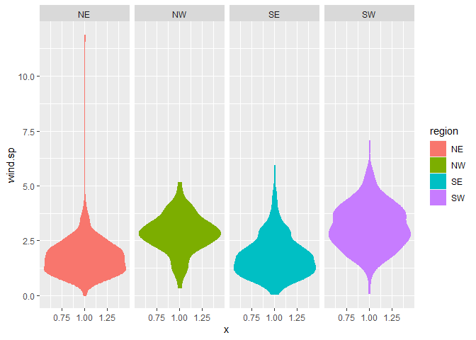
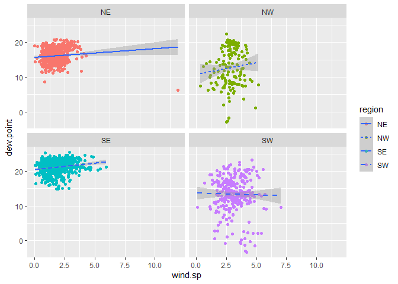

Lab 04
================
2022-09-14

``` r
library(lubridate)
```

    ## 
    ## 載入套件：'lubridate'

    ## 下列物件被遮斷自 'package:base':
    ## 
    ##     date, intersect, setdiff, union

``` r
library(tidyverse)
```

    ## -- Attaching packages --------------------------------------- tidyverse 1.3.1 --

    ## v ggplot2 3.3.5     v purrr   0.3.4
    ## v tibble  3.1.4     v dplyr   1.0.7
    ## v tidyr   1.1.3     v stringr 1.4.0
    ## v readr   2.0.1     v forcats 0.5.1

    ## -- Conflicts ------------------------------------------ tidyverse_conflicts() --
    ## x lubridate::as.difftime() masks base::as.difftime()
    ## x lubridate::date()        masks base::date()
    ## x dplyr::filter()          masks stats::filter()
    ## x lubridate::intersect()   masks base::intersect()
    ## x dplyr::lag()             masks stats::lag()
    ## x lubridate::setdiff()     masks base::setdiff()
    ## x lubridate::union()       masks base::union()

``` r
library(data.table)
```

    ## 
    ## 載入套件：'data.table'

    ## 下列物件被遮斷自 'package:dplyr':
    ## 
    ##     between, first, last

    ## 下列物件被遮斷自 'package:purrr':
    ## 
    ##     transpose

    ## 下列物件被遮斷自 'package:lubridate':
    ## 
    ##     hour, isoweek, mday, minute, month, quarter, second, wday, week,
    ##     yday, year

## Step 1. Read in the data

First download and then read in with data.table:fread()

``` r
if (!file.exists("met_all.gz")){
  download.file("https://raw.githubusercontent.com/USCbiostats/data-science-data/master/02_met/met_all.gz", "met_all.gz", method="libcurl", timeout = 60)
}

met <- data.table::fread("met_all.gz")
```

## 2. Prepare the data

Remove temperatures less than -17C and change elev 9999 to missing value
code.

``` r
met <- met[met$temp >= -17][elev == 9999.0, elev:= NA]
```

Generate a date variable using the functions as.Date() (hint: You will
need the following to create a date paste(year, month, day, sep = “-”)).

``` r
met <- met[, ymd := as.Date(paste(year, month, day, sep = "-"))]
```

Using the data.table::week function, keep the observations of the first
week of the month.

``` r
met[, table(week(ymd))]
```

    ## 
    ##     31     32     33     34     35 
    ## 297260 521605 527924 523847 446576

``` r
met <- met[week(ymd)==31]
```

Compute the mean by station of the variables temp, rh, wind.sp,
vis.dist, dew.point, lat, lon, and elev.

``` r
met[ , .(
  temp      = max(temp),
  rh        = max(rh, na.rm=T), 
  wind.sp   = max(wind.sp, na.rm=T), 
  vis.dist  = max(vis.dist, na.rm=T), 
  dew.point = max(dew.point, na.rm=T), 
  lat       = max(lat, na.rm=T), 
  lon       = max(lon, na.rm=T), 
  elev      = max(elev, na.rm=T)
)]
```

    ##    temp  rh wind.sp vis.dist dew.point    lat     lon elev
    ## 1:   47 100    20.6   144841        29 48.941 -68.313 4113

``` r
met_avg <- met[ , .(
  temp      = mean(temp),
  rh        = mean(rh, na.rm=T), 
  wind.sp   = mean(wind.sp, na.rm=T), 
  vis.dist  = mean(vis.dist, na.rm=T), 
  dew.point = mean(dew.point, na.rm=T), 
  lat       = mean(lat, na.rm=T), 
  lon       = mean(lon, na.rm=T), 
  elev      = mean(elev, na.rm=T)
), by = "USAFID"]
```

Create a region variable for NW, SW, NE, SE based on lon = -98.00 and
lat = 39.71 degrees

``` r
met_avg[, region := fifelse(lon >= -98 & lat > 39.71, "NE", 
                fifelse(lon < -98 & lat > 39.71, "NW",
                fifelse(lon < -98 & lat <= 39.71, "SW",
                "SE")))
    ]
table(met_avg$region)
```

    ## 
    ##  NE  NW  SE  SW 
    ## 484 146 649 297

Create a categorical variable for elevation as in the lecture slides

``` r
met_avg[ ,elev_cat := fifelse(elev > 252, "high", "low")]
```

## 3. Make Viloin plots of dew point temp by design

``` r
met_avg[!is.na(region)] %>%
  ggplot() +
  geom_violin(mapping = aes( x=1, y= dew.point, color= region, fill=region))+
  facet_wrap(~region, nrow = 1)
```

    ## Warning: Removed 1 rows containing non-finite values (stat_ydensity).

<!-- -->

The highest dew point temperatures are reported inthe southeast.

``` r
met_avg[!is.na(region)& !is.na(wind.sp)] %>%
  ggplot() +
  geom_violin(mapping = aes( x=1, y= wind.sp, color= region, fill=region))+
  facet_wrap(~region, nrow = 1)
```

<!-- -->

The highest wind spped seem to occur in the NE.

## 4. Use geom_point with geom_smooth to examine the association between dew point temperature and wind speed by region

Colour points by region Make sure to deal with NA category Fit a linear
regression line by region Describe what you observe in the graph

``` r
met_avg[!is.na(region)& !is.na(wind.sp)& !is.na(dew.point)] %>%
  ggplot(mapping = aes( x=wind.sp, y= dew.point))+
  geom_point(mapping = aes(color=region))+
  geom_smooth(method = lm, mapping = aes(linetype = region))+
  facet_wrap(~region, nrow = 2)
```

    ## `geom_smooth()` using formula 'y ~ x'

<!-- -->
