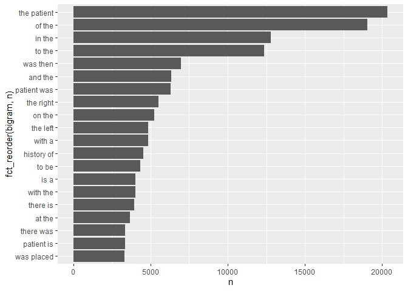

Lab 06
================
2022-09-28

``` r
library(tidytext)
library(tidyverse)
```

    ## -- Attaching packages --------------------------------------- tidyverse 1.3.1 --

    ## v ggplot2 3.3.5     v purrr   0.3.4
    ## v tibble  3.1.4     v dplyr   1.0.7
    ## v tidyr   1.1.3     v stringr 1.4.0
    ## v readr   2.0.1     v forcats 0.5.1

    ## -- Conflicts ------------------------------------------ tidyverse_conflicts() --
    ## x dplyr::filter() masks stats::filter()
    ## x dplyr::lag()    masks stats::lag()

``` r
library(dplyr)
library(ggplot2)
library(forcats)
```

## Step 1. Read in the data

First download and then read in with read.csv()

``` r
if (!file.exists("mtsamples.csv")){
  download.file("https://raw.githubusercontent.com/USCbiostats/data-science-data/master/00_mtsamples/mtsamples.csv",
                "mtsamples.csv", method="libcurl", timeout = 60)
}

mts <- read.csv("mtsamples.csv")
str(mts)
```

    ## 'data.frame':    4999 obs. of  6 variables:
    ##  $ X                : int  0 1 2 3 4 5 6 7 8 9 ...
    ##  $ description      : chr  " A 23-year-old white female presents with complaint of allergies." " Consult for laparoscopic gastric bypass." " Consult for laparoscopic gastric bypass." " 2-D M-Mode. Doppler.  " ...
    ##  $ medical_specialty: chr  " Allergy / Immunology" " Bariatrics" " Bariatrics" " Cardiovascular / Pulmonary" ...
    ##  $ sample_name      : chr  " Allergic Rhinitis " " Laparoscopic Gastric Bypass Consult - 2 " " Laparoscopic Gastric Bypass Consult - 1 " " 2-D Echocardiogram - 1 " ...
    ##  $ transcription    : chr  "SUBJECTIVE:,  This 23-year-old white female presents with complaint of allergies.  She used to have allergies w"| __truncated__ "PAST MEDICAL HISTORY:, He has difficulty climbing stairs, difficulty with airline seats, tying shoes, used to p"| __truncated__ "HISTORY OF PRESENT ILLNESS: , I have seen ABC today.  He is a very pleasant gentleman who is 42 years old, 344 "| __truncated__ "2-D M-MODE: , ,1.  Left atrial enlargement with left atrial diameter of 4.7 cm.,2.  Normal size right and left "| __truncated__ ...
    ##  $ keywords         : chr  "allergy / immunology, allergic rhinitis, allergies, asthma, nasal sprays, rhinitis, nasal, erythematous, allegr"| __truncated__ "bariatrics, laparoscopic gastric bypass, weight loss programs, gastric bypass, atkin's diet, weight watcher's, "| __truncated__ "bariatrics, laparoscopic gastric bypass, heart attacks, body weight, pulmonary embolism, potential complication"| __truncated__ "cardiovascular / pulmonary, 2-d m-mode, doppler, aortic valve, atrial enlargement, diastolic function, ejection"| __truncated__ ...

``` r
mts <- as_tibble(mts)
mts
```

    ## # A tibble: 4,999 x 6
    ##        X description    medical_special~ sample_name  transcription   keywords  
    ##    <int> <chr>          <chr>            <chr>        <chr>           <chr>     
    ##  1     0 " A 23-year-o~ " Allergy / Imm~ " Allergic ~ "SUBJECTIVE:, ~ "allergy ~
    ##  2     1 " Consult for~ " Bariatrics"    " Laparosco~ "PAST MEDICAL ~ "bariatri~
    ##  3     2 " Consult for~ " Bariatrics"    " Laparosco~ "HISTORY OF PR~ "bariatri~
    ##  4     3 " 2-D M-Mode.~ " Cardiovascula~ " 2-D Echoc~ "2-D M-MODE: ,~ "cardiova~
    ##  5     4 " 2-D Echocar~ " Cardiovascula~ " 2-D Echoc~ "1.  The left ~ "cardiova~
    ##  6     5 " Morbid obes~ " Bariatrics"    " Laparosco~ "PREOPERATIVE ~ "bariatri~
    ##  7     6 " Liposuction~ " Bariatrics"    " Liposucti~ "PREOPERATIVE ~ "bariatri~
    ##  8     7 " 2-D Echocar~ " Cardiovascula~ " 2-D Echoc~ "2-D ECHOCARDI~ "cardiova~
    ##  9     8 " Suction-ass~ " Bariatrics"    " Lipectomy~ "PREOPERATIVE ~ "bariatri~
    ## 10     9 " Echocardiog~ " Cardiovascula~ " 2-D Echoc~ "DESCRIPTION:,~ "cardiova~
    ## # ... with 4,989 more rows

# Question 1: What specialties do we have?

We can use count() from dplyr to figure out how many records are there
per speciality.

``` r
specialties <- 
  mts %>%
  count(medical_specialty)

specialties %>% 
  arrange(desc(n)) %>%
knitr::kable()
```

| medical_specialty             |    n |
|:------------------------------|-----:|
| Surgery                       | 1103 |
| Consult - History and Phy.    |  516 |
| Cardiovascular / Pulmonary    |  372 |
| Orthopedic                    |  355 |
| Radiology                     |  273 |
| General Medicine              |  259 |
| Gastroenterology              |  230 |
| Neurology                     |  223 |
| SOAP / Chart / Progress Notes |  166 |
| Obstetrics / Gynecology       |  160 |
| Urology                       |  158 |
| Discharge Summary             |  108 |
| ENT - Otolaryngology          |   98 |
| Neurosurgery                  |   94 |
| Hematology - Oncology         |   90 |
| Ophthalmology                 |   83 |
| Nephrology                    |   81 |
| Emergency Room Reports        |   75 |
| Pediatrics - Neonatal         |   70 |
| Pain Management               |   62 |
| Psychiatry / Psychology       |   53 |
| Office Notes                  |   51 |
| Podiatry                      |   47 |
| Dermatology                   |   29 |
| Cosmetic / Plastic Surgery    |   27 |
| Dentistry                     |   27 |
| Letters                       |   23 |
| Physical Medicine - Rehab     |   21 |
| Sleep Medicine                |   20 |
| Endocrinology                 |   19 |
| Bariatrics                    |   18 |
| IME-QME-Work Comp etc.        |   16 |
| Chiropractic                  |   14 |
| Diets and Nutritions          |   10 |
| Rheumatology                  |   10 |
| Speech - Language             |    9 |
| Autopsy                       |    8 |
| Lab Medicine - Pathology      |    8 |
| Allergy / Immunology          |    7 |
| Hospice - Palliative Care     |    6 |

These are 40 medical specialties.

``` r
specialties %>%
  top_n(10) %>%
  ggplot( aes(x = n, y= fct_reorder(medical_specialty, n))) +
  geom_col()
```

    ## Selecting by n

<!-- -->

The distribution is not at all uniform.

# Question 2

Tokenize the the words in the transcription column Count the number of
times each token appears Visualize the top 20 most frequent words
Explain what we see from this result. Does it makes sense? What insights
(if any) do we get?

``` r
mts %>%
  unnest_tokens(token, transcription) %>%
  count(token, sort = TRUE) %>%
  top_n(20, n) %>%
  ggplot(aes(n, fct_reorder(token, n))) +
  geom_col()
```

<!-- -->

There are a lot of stopwords here, non-specific to medical text. We do
see “patient”, phew!

## Question 3. Redo analysis in Q2, and remove stopwords.

Redo visualization but remove stopwords before Bonus points if you
remove numbers as well

``` r
mts %>%
  unnest_tokens(word, transcription) %>%
  count(word, sort = TRUE) %>%
  anti_join(stop_words, by = c("word")) %>%
  # use regular expression to filter out numbers
  filter( !grepl(pattern = "^[0-9]+$", x = word )) %>%
  top_n(20, n) %>%
  ggplot(aes(n, fct_reorder(word, n))) +
  geom_col()
```

<!-- -->

Removing the stopwords and nubmers gives us a much better idea of what
the text is about.

## Question 4

repeat question 2, but this time tokenize into bi-grams.

``` r
mts %>%
  unnest_ngrams(bigram, transcription, n=2) %>%
  count(bigram, sort = TRUE) %>%
  #anti_join(stop_words, by = c("word")) %>%
  top_n(20, n) %>%
  ggplot(aes(n, fct_reorder(bigram, n))) +
  geom_col()
```

<!-- -->

``` r
mts %>%
  unnest_ngrams(trigram, transcription, n=3) %>%
  count(trigram, sort = TRUE) %>%
  #anti_join(stop_words, by = c("word")) %>%
  top_n(20, n) %>%
  ggplot(aes(n, fct_reorder(trigram, n))) +
  geom_col()
```

<!-- -->

Top 20 trigrams seemed to return a few more medical word group than
bigrams.

## Question 5

Using the results you got from questions 4. Pick a word and count the
words that appears after and before it.

``` r
ptbigram <- mts %>%
  unnest_ngrams(bigram, transcription, n=2) %>%
  separate(bigram, into = c("word1", "word2"), sep = " ") %>%
  select(word1, word2) %>%
  filter(word1 == "patient" | word2 == "patient")
```

Words appear before patient:

``` r
ptbigram %>% 
  filter(word2 == "patient") %>%
  count(word1, sort = TRUE) %>%
  anti_join(stop_words, by = c("word1" = "word")) %>%
  top_n(10) %>%
knitr::kable()
```

    ## Selecting by n

| word1       |   n |
|:------------|----:|
| history     | 101 |
| procedure   |  32 |
| female      |  26 |
| sample      |  23 |
| male        |  22 |
| illness     |  16 |
| plan        |  16 |
| indications |  15 |
| allergies   |  14 |
| correct     |  11 |
| detail      |  11 |

Find the words following patient:

``` r
ptbigram %>% 
  filter(word1 == "patient") %>%
  count(word2, sort = TRUE) %>%
  anti_join(stop_words, by = c("word2" = "word")) %>%
  top_n(10) %>%
knitr::kable()
```

    ## Selecting by n

| word2      |   n |
|:-----------|----:|
| tolerated  | 994 |
| denies     | 552 |
| underwent  | 180 |
| received   | 160 |
| reports    | 155 |
| understood | 113 |
| lives      |  81 |
| admits     |  69 |
| appears    |  68 |
| including  |  67 |

## Question 6

Which words are most used in each of the specialties. you can use
group_by() and top_n() from dplyr to have the calculations be done
within each specialty. Remember to remove stopwords. How about the most
5 used words?
