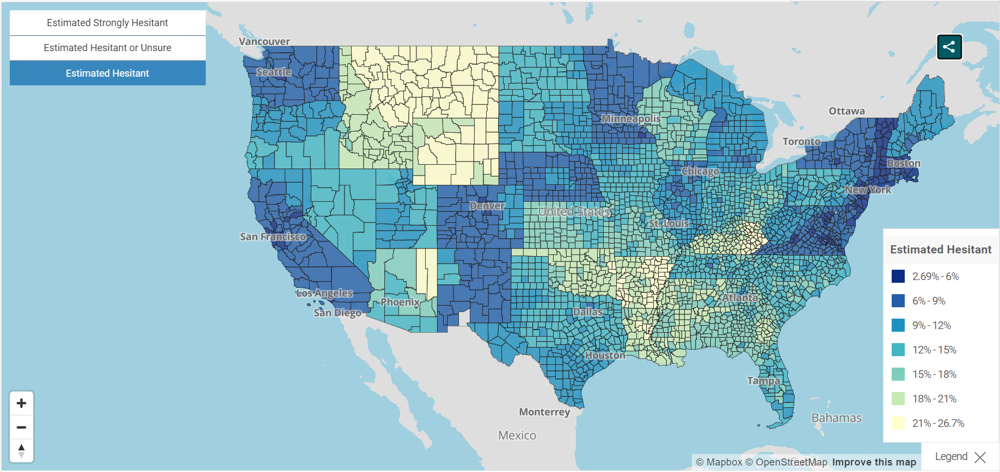

```{r setup, include=FALSE}
knitr::opts_chunk$set(echo = TRUE)
```

```{r install-libraries}
library(webshot)
library(lubridate)
library(tidyverse)
library(data.table)
library(leaflet)
library(readxl)
library(RSocrata)
```
# Introduction

Vaccine hesitancy, which is the reluctance or refusal to vaccinate despite the availability of vaccines,  has been proposed by the World Health Organization (WHO) as one of the ten threats to global health in 2019 https://www.who.int/news-room/spotlight/ten-threats-to-global-health-in-2019, even before the global pandemic of COVID-19.

Vaccine is currently one of the most cost-effective ways of preventing disease outbreak and reducing disease consequence, and consequently disease's impact on economic. As of 2019, 2-3 million deaths a year are prevented by vaccination. If global coverage of vaccinations is improved , an estimated 1.5 million of death could be further avoided.

As for the reason of vaccines hesitancy are complex, could be a result of numerous factors including lack of education, knowledge of how vacines are produce, distrust of government or authorities, or even just fear of needles. Its existence dates back the time vaccines were invented, however, it is only recently that it started to resurface to the discussion of mainstream media. 

After the global outbreak of COVID-19 and the invention of COVID-19 vaccines, vaccine hesitancy plays an even more important role than before.  We can observe vaccines being not just a measure of disease prevention, but also a mean of politics, yet we can also see a subset of population refused to get vaccinated even with the resources at hand.

This report is not to discuss the cause of vaccine hesitancy or the legitimacy of the claims by certain "anti-vaccinationism", but to see if vaccine hesitancy actually impacts the death and case number of COVID-19 on a state level in the US.  

# Methods

## Step 1. Read in the data using both API web scrapping and read_excel

A total of 3 datasets will be used in this project. The first two are from US Center for Disease Control and Prevention, and the third one are from United States Census Bureau (an official website of the United State Government).

1. The fisrt dataset is "Vaccine Hesitancy for COVID-19: County and local estimates" from https://data.cdc.gov/Vaccinations/Vaccine-Hesitancy-for-COVID-19-County-and-local-es/q9mh-h2tw 

```{r, cache=TRUE}
ori_hes <- read.socrata(
  "https://data.cdc.gov/resource/q9mh-h2tw.json",
  app_token = "trg1fGPbmeJk0ZrQSlXmQMTBV",
  email     = "tzuyuhua@usc.edu",
  password  = "CodingCary0130"
)

hes <- as.data.table(ori_hes)
```

Two variables (state_boundary.coordinates & county_boundary.coordinates(multipolygon information)) in the hes dataset took up too much space and is not related to the research question this time, so I'll remove or modify them.

```{r}
hes$state_boundary.coordinates <- NULL
hes$county_boundary.coordinates <- NULL
```

And the main vaccine hesitency related variables we will be looking today are as follows.

```{r}
Variable <- c("Estimated hesitant", "Estimated hesitant or unsure", "Estimated strongly hesitant", "Social Vulnerability Index (SVI)")
Description <- c("Estimate of percentage of adults who describe themselves as “probably not” or “definitely not” going to get a COVID-19 vaccine once one is available to them, based on national survey data.", "Estimate of percentage of adults who describe themselves as “unsure”, “probably not”, or “definitely not” going to get a COVID-19 vaccine once one is available to them, based on national survey data.", "Estimate of percentage of adults who describe themselves as “definitely not” going to get a COVID-19 vaccine once one is available to them, based on national survey data.", "	
SVI values range from 0 (least vulnerable) to 1 (most vulnerable).")
knitr::kable(rbind(Variable, Description), caption = "Main vaccine hesitency related variables from Vaccine Hesitancy for COVID-19: County and local estimates")
```


2. The second dataset is "United States COVID-19 Cases and Deaths by State over Time" from https://data.cdc.gov/Case-Surveillance/United-States-COVID-19-Cases-and-Deaths-by-State-o/9mfq-cb36

And the main variable we'll be looking are 

tot_cases: Total number of cases

tot_death: Total number of deaths.


```{r, cache=TRUE}
death <- read.socrata(
  "https://data.cdc.gov/resource/9mfq-cb36.json",
  app_token = "Sc1lehIxeCtFlCTmvmYgobCJD",
  email     = "tzuyuhua@usc.edu",
  password  = "CodingCary0130"
)

death <- as.data.table(death)

```


3. And for the comparison between states summary statistics to be reasonable and effective, I need the population data of different places. "County Population Totals: 2020-2021" from https://www.census.gov/data/tables/time-series/demo/popest/2020s-counties-total.html


```{r}
county_pop <- read_excel("co-est2021-pop.xlsx", range = "A6:D3149", col_names = FALSE)
colnames(county_pop) <- c("county_name", "April2020", "Jul2020", "July2021")

Variable <-c("county_name", "April2020", "Jul2020", "July2021")

Description <- c("Geographic Area", "April 1, 2020 Estimates Base", "2020 Population Estimate (as of July 1)", "2021 Population Estimate (as of July 1)")


knitr::kable(rbind(Variable, Description), caption = "Variable of County Population Totals: 2020-2021")
```


## EDA checklist for all 3 datasets

Check the dimensions, headers, footers, variable names and variable types

```{r}
dim(hes)
head(hes)
tail(hes)
```

```{r}
dim(death)
head(death)
tail(death)
```

```{r}
dim(county_pop)
head(county_pop)
tail(county_pop)
```

Now I want to check if there’s any missing or improbable value in the key variables.

```{r}
hes$estimated_hesitant <- as.numeric(hes$estimated_hesitant)
hes$estimated_hesitant_or_unsure <- as.numeric(hes$estimated_hesitant_or_unsure)
hes$estimated_strongly_hesitant <- as.numeric(hes$estimated_strongly_hesitant)
hes$social_vulnerability_index <- as.numeric(hes$social_vulnerability_index)

summary(hes$estimated_hesitant)
summary(hes$estimated_hesitant_or_unsure)
summary(hes$estimated_strongly_hesitant)
summary(hes$social_vulnerability_index)

length(unique(hes$county_name))
# Since there are 3142 counties, I will not show the full table here.
head(table(hes$county_name))
sum(is.na(hes$county_name))
table(hes$state_code)
```

```{r}
death$tot_cases <- as.numeric(death$tot_cases)
death$tot_death <- as.numeric(death$tot_death)

summary(death$tot_cases)
summary(death$tot_death)

table(death$state)

sum(is.na(death$submission_date))
```


```{r}
summary(county_pop$July2021)

length(unique(county_pop$county_name))
# Since there are 3144 counties, I will not show the full table here.
head(table(county_pop$county_name))
sum(is.na(county_pop$county_name))
```


Summary: 
Dateset "death" seems to have more NA's compare to the other two datasets, fortunately not in the key variables we are interested in. On the otherhand, there is one missing value in social_vulnerability_index in dataset "hes", we will deal with it later. No abnormal values are observed. And the county_name between dataset "hes" and "county_pop" are different, so we'll deal with that to.


## Estimated state vaccine hesitancy level

Now that in order for us to estimate state vaccine hesitancy level, I'll assign population size to each county by merging the hesitancy and population dataset.

But before we do the merge, there are some slight differences in county_name for the two datasets (mentioned before). So I'll modify both of them a little bit so that they can merge properly. 

```{r}
county_pop$county_name <- gsub("\\.","", county_pop$county_name)
county_pop$county_name <- gsub("\\,","", county_pop$county_name)
hes$county_name <- gsub("\\,","", hes$county_name)
hes$county_name <- gsub("\\.","", hes$county_name)
county_pop <- as.data.table(county_pop)
```

Then check if all counties in the hes dataset has a corresponding county in the county_pop dataset.

```{r}
sum( !hes$county_name %in% county_pop$county_name)
```

Merge

```{r}
hes <- 
  merge(
  # Data
  x     = hes,      
  y     = county_pop[, .(county_name, July2021)], 
  # List of variables to match
  by.x  = "county_name",
  by.y  = "county_name", 
  # Which obs to keep?
  all.x = TRUE,      
  all.y = FALSE
  )
```

Check the dimension to see if created duplicated data.

```{r}
dim(hes)
```

Since that we have seen from the EDA checklist that there are one missing value in the "social_vulnerability_index" variable, I'll impute it from the mean of other counties of the same state. Reason giving that people from the same state are more likely to be homogeneous. 

```{r}
hes[, social_vulnerability_index := fcoalesce(social_vulnerability_index, mean(social_vulnerability_index, na.rm = TRUE)),
    by = .(state)]
```

##Estimate state level metrics

Calculate State population (by adding up the counties population)

```{r}
hes[ , state_pop  := sum(July2021), by = .(state_code)]
```

Since the hesitancy variables are by nature a percentage, so I'll derived the Estimated State level hesitant by a weighted mean of the County level hesitant with the county population as weight.

```{r}
hes[ , state_hes      := sum(estimated_hesitant*July2021)/state_pop , by = .(state_code)]
hes[ , state_hes_uns  := sum(estimated_hesitant_or_unsure*July2021)/state_pop, by = .(state_code)]
hes[ , state_stro_hes := sum(estimated_strongly_hesitant*July2021)/state_pop, by = .(state_code)]
hes[ , SVI := sum(social_vulnerability_index*July2021)/state_pop, by = .(state_code)]
```

## Categorize SVI

Overall social vulnerability index was attained through the 2018 CDC Social Vulnerability Index. The CDC's Social Vulnerability Index (SVI) summarizes the degree of a community' social vulnerability to disaster. SVI considers numerous factors including housing language ability, economic data, family characteristics, data regarding education, ethnicity, and vehicle access. 
SVI values range from 0 (least vulnerable) to 1 (most vulnerable). The SVI can also be categorized as follows: Very Low (0.0-0.19), Low (0.20-0.39); Moderate (0.40-0.59); High (0.60-0.79); Very High (0.80-1.0).

```{r}
hes <- hes[, state_SVI_cat := fifelse( SVI <= 0.19, "Very Low", 
                        fifelse( SVI <= 0.39, "Low",
                        fifelse( SVI <= 0.59, "Moderate",
                        fifelse( SVI <= 0.79, "High",
                       "Very High"))))
 ]

knitr::kable(table(hes$state_SVI_cat), caption = "Summary table of stave level SVI categories")
```

For us to explore the relationship between COVID-19 death and cases and hesitancy, I merge the data again with the COVID-19 death and cases dataset.

```{r}
merge <- 
  merge(
  # Data
  x     = death,      
  y     = unique(hes[, .(state, state_code, state_hes, state_hes_uns, state_stro_hes, SVI, state_SVI_cat, state_pop)]), 
  # List of variables to match
  by.x  = "state",
  by.y  = "state_code", 
  # Which obs to keep?
  all.x = TRUE,      
  all.y = FALSE
  )

merge <- as.data.table(merge)
```

Because both variable of interest are cumulative by nature, I'll select the information of the latest date by state.

```{r}
merge[ , max.date      := max(submission_date), by = .(state)]
date_mer <- merge[merge$max.date == merge$submission_date, ]
```

After reviewing the data, there are a total number of 60 states in the COVID-19 death and cases dataset, after investigation, those state include US territory oversea such as Guam and American Samoa, for this investigation, I'll just focus on non-overseas US states. 

```{r}
length(unique(death$state))
length(unique(hes$state))
```

```{r}
state_mer <-  date_mer[ date_mer$state %in% hes$state_code]
length(unique(state_mer$state))
```

# Results

Lets first have a visualization of which area has the highest estimated hesitant.
https://data.cdc.gov/Vaccinations/Vaccine-Hesitancy-for-COVID-19-County-and-local-es/q9mh-h2tw 

```{r}

```

It seems like that around Los Angeles and New Work city are not very vaccine hesitant, but arond Montana and Wyoming are kind of hesitant to vaccines. 


Now lets take a look at the main research question.

```{r}
state_mer$tot_cases <- as.numeric(state_mer$tot_cases)
state_mer$tot_death <- as.numeric(state_mer$tot_death)

state_mer %>%
  ggplot(mapping = aes(x = state_hes, y = tot_cases/state_pop)) +
  geom_point() + 
  geom_smooth(method = lm, se = FALSE, col = "black")
```

It does appear that there is some positive correlation between vaccine hesitancy and total number of cases (proportion to state population size).

```{r}
state_mer %>%
  ggplot(mapping = aes(x = state_hes, y = tot_death/state_pop)) +
  geom_point() + 
  geom_smooth(method = lm, se = FALSE, col = "black")
```

From the above graph, there is also a positive correlation between vaccine hesitancy and total number of deaths (proportion to state population size). And the slope appears to be even steeper.

Same plots but for more extreme hesitancy.

```{r}
state_mer %>%
  ggplot(mapping = aes(x = state_stro_hes, y = tot_cases/state_pop)) +
  geom_point() + 
  geom_smooth(method = lm, se = FALSE, col = "black")
```


```{r}
state_mer %>%
  ggplot(mapping = aes(x = state_stro_hes, y = tot_death/state_pop)) +
  geom_point() + 
  geom_smooth(method = lm, se = FALSE, col = "black")
```


Now lets see if SVI is correlated with the outcome as well.

```{r}
state_mer %>%
  ggplot(mapping = aes(x = SVI, y = tot_cases/state_pop)) +
  geom_point() + 
  geom_smooth(method = lm, se = FALSE, col = "black")
```


```{r}
state_mer %>%
  ggplot(mapping = aes(x = SVI, y = tot_death/state_pop)) +
  geom_point() + 
  geom_smooth(method = lm, se = FALSE, col = "black")
```

Very similar to the previous results, both total number of deaths and cases (proportion to state population sizes) are positively correlated with SVI, with death showing a slightly steeper slope.

Lets also look at the distribution of the SVI categories, state wise.

```{r}
state_mer %>%
  ggplot() + 
  geom_bar(mapping = aes(x = state_SVI_cat, colour = state_SVI_cat, fill=state_SVI_cat))
```

There are the least amount of states being categorized as "Very low".

```{r}
state_mer %>% 
  ggplot()+
  geom_boxplot(mapping=aes(x=state_SVI_cat, y=tot_cases/state_pop, fill=state_SVI_cat))
```

The above graph shows that states categorized as "High" seems to have the highest total number of cases (proportion to state population sizes), but the differences are not obvious.

```{r}
state_mer %>% 
  ggplot()+
  geom_boxplot(mapping=aes(x=state_SVI_cat, y=tot_death/state_pop, fill=state_SVI_cat))
```

Similar trends for total number of deaths (proportion to state population sizes), but the differences are more obvious this time.

# Conclusion

Overall, vaccine hesitancy does show to have a positive correlation with death and cases, and death especially, which is in accordance with the general science community consensus, that vaccine can slow down the rate of COVID-19 transmission, and reduce COVID-19 symptom severity (increase protection against hospitalization and death in people).  

In addition to vaccine hesitancy, SVI also shows visual correlation with the outcome, suggesting that there may be aspects other than vaccine that can be improved to reduce the severity of a pandemic. 

