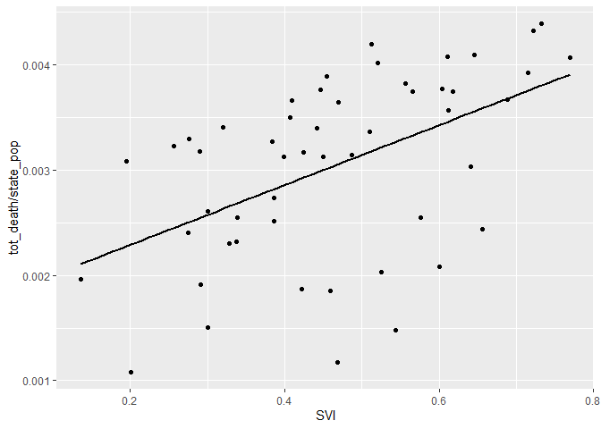
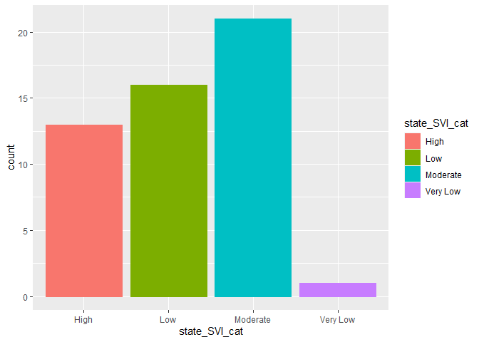

midterm
================
2022-10-19

``` r
library(webshot)
library(lubridate)
```

    ## 
    ## 載入套件：'lubridate'

    ## 下列物件被遮斷自 'package:base':
    ## 
    ##     date, intersect, setdiff, union

``` r
library(tidyverse)
```

    ## ── Attaching packages
    ## ───────────────────────────────────────
    ## tidyverse 1.3.2 ──

    ## ✔ ggplot2 3.3.6      ✔ purrr   0.3.5 
    ## ✔ tibble  3.1.8      ✔ dplyr   1.0.10
    ## ✔ tidyr   1.2.1      ✔ stringr 1.4.1 
    ## ✔ readr   2.1.3      ✔ forcats 0.5.2 
    ## ── Conflicts ────────────────────────────────────────── tidyverse_conflicts() ──
    ## ✖ lubridate::as.difftime() masks base::as.difftime()
    ## ✖ lubridate::date()        masks base::date()
    ## ✖ dplyr::filter()          masks stats::filter()
    ## ✖ lubridate::intersect()   masks base::intersect()
    ## ✖ dplyr::lag()             masks stats::lag()
    ## ✖ lubridate::setdiff()     masks base::setdiff()
    ## ✖ lubridate::union()       masks base::union()

``` r
library(data.table)
```

    ## 
    ## 載入套件：'data.table'
    ## 
    ## 下列物件被遮斷自 'package:dplyr':
    ## 
    ##     between, first, last
    ## 
    ## 下列物件被遮斷自 'package:purrr':
    ## 
    ##     transpose
    ## 
    ## 下列物件被遮斷自 'package:lubridate':
    ## 
    ##     hour, isoweek, mday, minute, month, quarter, second, wday, week,
    ##     yday, year

``` r
library(leaflet)
library(readxl)
library(RSocrata)
```

# Introduction

# Methods

## Step 1. Read in the data using both API web scrapping and read_excel

A total of 3 datasets will be used in this project. The first two are
from US Center for Disease Control and Prevention, and the third one are
from United States Census Bureau (an official website of the United
State Government).

The fisrt dataset is “Vaccine Hesitancy for COVID-19: County and local
estimates” from
<https://data.cdc.gov/Vaccinations/Vaccine-Hesitancy-for-COVID-19-County-and-local-es/q9mh-h2tw>

``` r
ori_hes <- read.socrata(
  "https://data.cdc.gov/resource/q9mh-h2tw.json",
  app_token = "trg1fGPbmeJk0ZrQSlXmQMTBV",
  email     = "tzuyuhua@usc.edu",
  password  = "CodingCary0130"
)

hes <- as.data.table(ori_hes)
```

Two variables (state_boundary.coordinates &
county_boundary.coordinates(multipolygon information)) in the hes
dataset took up too much space and is not related to the research
question this time, so I’ll remove or modify them.

``` r
hes$state_boundary.coordinates <- NULL
hes$county_boundary.coordinates <- NULL
```

And the main vaccine hesitency related variables we will be looking
today are as follows.

``` r
Variable <- c("Estimated hesitant", "Estimated hesitant or unsure", "Estimated strongly hesitant", "Social Vulnerability Index (SVI)")
Description <- c("Estimate of percentage of adults who describe themselves as “probably not” or “definitely not” going to get a COVID-19 vaccine once one is available to them, based on national survey data.", "Estimate of percentage of adults who describe themselves as “unsure”, “probably not”, or “definitely not” going to get a COVID-19 vaccine once one is available to them, based on national survey data.", "Estimate of percentage of adults who describe themselves as “definitely not” going to get a COVID-19 vaccine once one is available to them, based on national survey data.", " 
SVI values range from 0 (least vulnerable) to 1 (most vulnerable).")
knitr::kable(rbind(Variable, Description), caption = "Main vaccine hesitency related variables from Vaccine Hesitancy for COVID-19: County and local estimates")
```

|             |                                                                                                                                                                                              |                                                                                                                                                                                                         |                                                                                                                                                                            |                                                                    |
|:------------|:---------------------------------------------------------------------------------------------------------------------------------------------------------------------------------------------|:--------------------------------------------------------------------------------------------------------------------------------------------------------------------------------------------------------|:---------------------------------------------------------------------------------------------------------------------------------------------------------------------------|:-------------------------------------------------------------------|
| Variable    | Estimated hesitant                                                                                                                                                                           | Estimated hesitant or unsure                                                                                                                                                                            | Estimated strongly hesitant                                                                                                                                                | Social Vulnerability Index (SVI)                                   |
| Description | Estimate of percentage of adults who describe themselves as “probably not” or “definitely not” going to get a COVID-19 vaccine once one is available to them, based on national survey data. | Estimate of percentage of adults who describe themselves as “unsure”, “probably not”, or “definitely not” going to get a COVID-19 vaccine once one is available to them, based on national survey data. | Estimate of percentage of adults who describe themselves as “definitely not” going to get a COVID-19 vaccine once one is available to them, based on national survey data. | SVI values range from 0 (least vulnerable) to 1 (most vulnerable). |

Main vaccine hesitency related variables from Vaccine Hesitancy for
COVID-19: County and local estimates

The second dataset is “United States COVID-19 Cases and Deaths by State
over Time” from
<https://data.cdc.gov/Case-Surveillance/United-States-COVID-19-Cases-and-Deaths-by-State-o/9mfq-cb36>

And the main variable we’ll be looking are tot_cases: Total number of
cases tot_death: Total number of deaths.

``` r
death <- read.socrata(
  "https://data.cdc.gov/resource/9mfq-cb36.json",
  app_token = "Sc1lehIxeCtFlCTmvmYgobCJD",
  email     = "tzuyuhua@usc.edu",
  password  = "CodingCary0130"
)

death <- as.data.table(death)
```

And for the comparison between states summary statistics to be
reasonable and effective, I need the population data of different
places. “County Population Totals: 2020-2021” from
<https://www.census.gov/data/tables/time-series/demo/popest/2020s-counties-total.html>

``` r
county_pop <- read_excel("co-est2021-pop.xlsx", range = "A6:D3149", col_names = FALSE)
```

    ## New names:
    ## • `` -> `...1`
    ## • `` -> `...2`
    ## • `` -> `...3`
    ## • `` -> `...4`

``` r
colnames(county_pop) <- c("county_name", "April2020", "Jul2020", "July2021")

Variable <-c("county_name", "April2020", "Jul2020", "July2021")

Description <- c("Geographic Area", "April 1, 2020 Estimates Base", "2020 Population Estimate (as of July 1)", "2021 Population Estimate (as of July 1)")


knitr::kable(rbind(Variable, Description), caption = "Variable of County Population Totals: 2020-2021")
```

|             |                 |                              |                                         |                                         |
|:------------|:----------------|:-----------------------------|:----------------------------------------|:----------------------------------------|
| Variable    | county_name     | April2020                    | Jul2020                                 | July2021                                |
| Description | Geographic Area | April 1, 2020 Estimates Base | 2020 Population Estimate (as of July 1) | 2021 Population Estimate (as of July 1) |

Variable of County Population Totals: 2020-2021

## EDA checklist for all 3 datasets

Check the dimensions, headers, footers, variable names and variable
types

``` r
dim(hes)
```

    ## [1] 3142   22

``` r
head(hes)
```

    ##    fips_code             county_name   state estimated_hesitant
    ## 1:      1001 Autauga County, Alabama ALABAMA             0.1685
    ## 2:      1003 Baldwin County, Alabama ALABAMA             0.1544
    ## 3:      1005 Barbour County, Alabama ALABAMA             0.1676
    ## 4:      1007    Bibb County, Alabama ALABAMA             0.1808
    ## 5:      1009  Blount County, Alabama ALABAMA             0.1854
    ## 6:      1011 Bullock County, Alabama ALABAMA             0.1676
    ##    estimated_hesitant_or_unsure estimated_strongly_hesitant
    ## 1:                       0.2233                      0.1272
    ## 2:                       0.1988                      0.1169
    ## 3:                       0.2337                      0.1274
    ## 4:                       0.2526                       0.139
    ## 5:                       0.2362                      0.1416
    ## 6:                       0.2337                      0.1274
    ##    social_vulnerability_index            svi_category ability_to_handle_a_covid
    ## 1:                       0.44  Moderate Vulnerability                      0.61
    ## 2:                       0.22       Low Vulnerability                      0.23
    ## 3:                          1 Very High Vulnerability                      0.89
    ## 4:                        0.6      High Vulnerability                      0.76
    ## 5:                       0.42  Moderate Vulnerability                       0.8
    ## 6:                       0.89 Very High Vulnerability                      0.84
    ##        cvac_category percent_adults_fully percent_hispanic
    ## 1:      High Concern                0.288           0.0283
    ## 2:       Low Concern                0.336           0.0456
    ## 3: Very High Concern                0.257           0.0436
    ## 4:      High Concern                0.222           0.0257
    ## 5:      High Concern                0.215           0.0926
    ## 6: Very High Concern                0.382           0.0256
    ##    percent_non_hispanic_american percent_non_hispanic_asian
    ## 1:                        0.0025                     0.0103
    ## 2:                        0.0065                     0.0092
    ## 3:                        0.0029                     0.0048
    ## 4:                        0.0013                     0.0012
    ## 5:                        0.0007                     0.0037
    ## 6:                             0                     0.0049
    ##    percent_non_hispanic_black percent_non_hispanic_native
    ## 1:                       0.19                      0.0001
    ## 2:                     0.0917                           0
    ## 3:                     0.4744                           0
    ## 4:                     0.2214                           0
    ## 5:                     0.0153                      0.0004
    ## 6:                      0.748                           0
    ##    percent_non_hispanic_white geographical_point.type
    ## 1:                      0.746                   Point
    ## 2:                     0.8307                   Point
    ## 3:                     0.4581                   Point
    ## 4:                     0.7453                   Point
    ## 5:                     0.8689                   Point
    ## 6:                     0.2138                   Point
    ##    geographical_point.coordinates state_code county_boundary.type
    ## 1:            -86.84452, 32.75689         AL         MultiPolygon
    ## 2:            -86.84452, 32.75689         AL         MultiPolygon
    ## 3:            -86.84452, 32.75689         AL         MultiPolygon
    ## 4:            -86.84452, 32.75689         AL         MultiPolygon
    ## 5:            -86.84452, 32.75689         AL         MultiPolygon
    ## 6:            -86.84452, 32.75689         AL         MultiPolygon
    ##    state_boundary.type
    ## 1:        MultiPolygon
    ## 2:        MultiPolygon
    ## 3:        MultiPolygon
    ## 4:        MultiPolygon
    ## 5:        MultiPolygon
    ## 6:        MultiPolygon

``` r
tail(hes)
```

    ##    fips_code                county_name   state estimated_hesitant
    ## 1:     56035   Sublette County, Wyoming WYOMING             0.2184
    ## 2:     56037 Sweetwater County, Wyoming WYOMING             0.2184
    ## 3:     56039      Teton County, Wyoming WYOMING              0.205
    ## 4:     56041      Uinta County, Wyoming WYOMING             0.2184
    ## 5:     56043   Washakie County, Wyoming WYOMING             0.2283
    ## 6:     56045     Weston County, Wyoming WYOMING             0.2283
    ##    estimated_hesitant_or_unsure estimated_strongly_hesitant
    ## 1:                       0.2843                      0.1584
    ## 2:                       0.2843                      0.1584
    ## 3:                       0.2671                      0.1472
    ## 4:                       0.2843                      0.1584
    ## 5:                       0.2943                      0.1687
    ## 6:                       0.2943                      0.1687
    ##    social_vulnerability_index           svi_category ability_to_handle_a_covid
    ## 1:                       0.03 Very Low Vulnerability                      0.55
    ## 2:                       0.37      Low Vulnerability                      0.56
    ## 3:                       0.11 Very Low Vulnerability                      0.44
    ## 4:                       0.45 Moderate Vulnerability                      0.48
    ## 5:                       0.37      Low Vulnerability                      0.69
    ## 6:                       0.35      Low Vulnerability                      0.51
    ##       cvac_category percent_adults_fully percent_hispanic
    ## 1: Moderate Concern                0.275            0.073
    ## 2: Moderate Concern                0.348           0.1588
    ## 3: Moderate Concern                0.789           0.1503
    ## 4: Moderate Concern                0.388           0.0913
    ## 5:     High Concern                0.364           0.1423
    ## 6: Moderate Concern                0.311           0.0108
    ##    percent_non_hispanic_american percent_non_hispanic_asian
    ## 1:                        0.0033                     0.0007
    ## 2:                        0.0102                     0.0074
    ## 3:                        0.0033                     0.0125
    ## 4:                        0.0065                     0.0016
    ## 5:                        0.0052                          0
    ## 6:                        0.0017                     0.0077
    ##    percent_non_hispanic_black percent_non_hispanic_native
    ## 1:                          0                           0
    ## 2:                     0.0112                      0.0003
    ## 3:                     0.0124                      0.0012
    ## 4:                     0.0011                           0
    ## 5:                     0.0004                           0
    ## 6:                     0.0023                      0.0011
    ##    percent_non_hispanic_white geographical_point.type
    ## 1:                     0.8927                   Point
    ## 2:                     0.7956                   Point
    ## 3:                     0.8134                   Point
    ## 4:                     0.8752                   Point
    ## 5:                      0.819                   Point
    ## 6:                     0.9637                   Point
    ##    geographical_point.coordinates state_code county_boundary.type
    ## 1:          -107.55145,  42.99963         WY         MultiPolygon
    ## 2:          -107.55145,  42.99963         WY         MultiPolygon
    ## 3:          -107.55145,  42.99963         WY         MultiPolygon
    ## 4:          -107.55145,  42.99963         WY         MultiPolygon
    ## 5:          -107.55145,  42.99963         WY         MultiPolygon
    ## 6:          -107.55145,  42.99963         WY         MultiPolygon
    ##    state_boundary.type
    ## 1:        MultiPolygon
    ## 2:        MultiPolygon
    ## 3:        MultiPolygon
    ## 4:        MultiPolygon
    ## 5:        MultiPolygon
    ## 6:        MultiPolygon

``` r
str(hes)
```

    ## Classes 'data.table' and 'data.frame':   3142 obs. of  22 variables:
    ##  $ fips_code                     : chr  "1001" "1003" "1005" "1007" ...
    ##  $ county_name                   : chr  "Autauga County, Alabama" "Baldwin County, Alabama" "Barbour County, Alabama" "Bibb County, Alabama" ...
    ##  $ state                         : chr  "ALABAMA" "ALABAMA" "ALABAMA" "ALABAMA" ...
    ##  $ estimated_hesitant            : chr  "0.1685" "0.1544" "0.1676" "0.1808" ...
    ##  $ estimated_hesitant_or_unsure  : chr  "0.2233" "0.1988" "0.2337" "0.2526" ...
    ##  $ estimated_strongly_hesitant   : chr  "0.1272" "0.1169" "0.1274" "0.139" ...
    ##  $ social_vulnerability_index    : chr  "0.44" "0.22" "1" "0.6" ...
    ##  $ svi_category                  : chr  "Moderate Vulnerability" "Low Vulnerability" "Very High Vulnerability" "High Vulnerability" ...
    ##  $ ability_to_handle_a_covid     : chr  "0.61" "0.23" "0.89" "0.76" ...
    ##  $ cvac_category                 : chr  "High Concern" "Low Concern" "Very High Concern" "High Concern" ...
    ##  $ percent_adults_fully          : chr  "0.288" "0.336" "0.257" "0.222" ...
    ##  $ percent_hispanic              : chr  "0.0283" "0.0456" "0.0436" "0.0257" ...
    ##  $ percent_non_hispanic_american : chr  "0.0025" "0.0065" "0.0029" "0.0013" ...
    ##  $ percent_non_hispanic_asian    : chr  "0.0103" "0.0092" "0.0048" "0.0012" ...
    ##  $ percent_non_hispanic_black    : chr  "0.19" "0.0917" "0.4744" "0.2214" ...
    ##  $ percent_non_hispanic_native   : chr  "0.0001" "0" "0" "0" ...
    ##  $ percent_non_hispanic_white    : chr  "0.746" "0.8307" "0.4581" "0.7453" ...
    ##  $ geographical_point.type       : chr  "Point" "Point" "Point" "Point" ...
    ##  $ geographical_point.coordinates:List of 3142
    ##   ..$ : num  -86.8 32.8
    ##   ..$ : num  -86.8 32.8
    ##   ..$ : num  -86.8 32.8
    ##   ..$ : num  -86.8 32.8
    ##   ..$ : num  -86.8 32.8
    ##   ..$ : num  -86.8 32.8
    ##   ..$ : num  -86.8 32.8
    ##   ..$ : num  -86.8 32.8
    ##   ..$ : num  -86.8 32.8
    ##   ..$ : num  -86.8 32.8
    ##   ..$ : num  -86.8 32.8
    ##   ..$ : num  -86.8 32.8
    ##   ..$ : num  -86.8 32.8
    ##   ..$ : num  -86.8 32.8
    ##   ..$ : num  -86.8 32.8
    ##   ..$ : num  -86.8 32.8
    ##   ..$ : num  -86.8 32.8
    ##   ..$ : num  -86.8 32.8
    ##   ..$ : num  -86.8 32.8
    ##   ..$ : num  -86.8 32.8
    ##   ..$ : num  -86.8 32.8
    ##   ..$ : num  -86.8 32.8
    ##   ..$ : num  -86.8 32.8
    ##   ..$ : num  -86.8 32.8
    ##   ..$ : num  -86.8 32.8
    ##   ..$ : num  -86.8 32.8
    ##   ..$ : num  -86.8 32.8
    ##   ..$ : num  -86.8 32.8
    ##   ..$ : num  -86.8 32.8
    ##   ..$ : num  -86.8 32.8
    ##   ..$ : num  -86.8 32.8
    ##   ..$ : num  -86.8 32.8
    ##   ..$ : num  -86.8 32.8
    ##   ..$ : num  -86.8 32.8
    ##   ..$ : num  -86.8 32.8
    ##   ..$ : num  -86.8 32.8
    ##   ..$ : num  -86.8 32.8
    ##   ..$ : num  -86.8 32.8
    ##   ..$ : num  -86.8 32.8
    ##   ..$ : num  -86.8 32.8
    ##   ..$ : num  -86.8 32.8
    ##   ..$ : num  -86.8 32.8
    ##   ..$ : num  -86.8 32.8
    ##   ..$ : num  -86.8 32.8
    ##   ..$ : num  -86.8 32.8
    ##   ..$ : num  -86.8 32.8
    ##   ..$ : num  -86.8 32.8
    ##   ..$ : num  -86.8 32.8
    ##   ..$ : num  -86.8 32.8
    ##   ..$ : num  -86.8 32.8
    ##   ..$ : num  -86.8 32.8
    ##   ..$ : num  -86.8 32.8
    ##   ..$ : num  -86.8 32.8
    ##   ..$ : num  -86.8 32.8
    ##   ..$ : num  -86.8 32.8
    ##   ..$ : num  -86.8 32.8
    ##   ..$ : num  -86.8 32.8
    ##   ..$ : num  -86.8 32.8
    ##   ..$ : num  -86.8 32.8
    ##   ..$ : num  -86.8 32.8
    ##   ..$ : num  -86.8 32.8
    ##   ..$ : num  -86.8 32.8
    ##   ..$ : num  -86.8 32.8
    ##   ..$ : num  -86.8 32.8
    ##   ..$ : num  -86.8 32.8
    ##   ..$ : num  -86.8 32.8
    ##   ..$ : num  -86.8 32.8
    ##   ..$ : num  -151.6 63.6
    ##   ..$ : num  -151.6 63.6
    ##   ..$ : num  -151.6 63.6
    ##   ..$ : num  -151.6 63.6
    ##   ..$ : num  -151.6 63.6
    ##   ..$ : num  -151.6 63.6
    ##   ..$ : num  -151.6 63.6
    ##   ..$ : num  -151.6 63.6
    ##   ..$ : num  -151.6 63.6
    ##   ..$ : num  -151.6 63.6
    ##   ..$ : num  -151.6 63.6
    ##   ..$ : num  -151.6 63.6
    ##   ..$ : num  -151.6 63.6
    ##   ..$ : num  -151.6 63.6
    ##   ..$ : num  -151.6 63.6
    ##   ..$ : num  -151.6 63.6
    ##   ..$ : num  -151.6 63.6
    ##   ..$ : num  -151.6 63.6
    ##   ..$ : num  -151.6 63.6
    ##   ..$ : num  -151.6 63.6
    ##   ..$ : num  -151.6 63.6
    ##   ..$ : num  -151.6 63.6
    ##   ..$ : num  -151.6 63.6
    ##   ..$ : num  -151.6 63.6
    ##   ..$ : num  -151.6 63.6
    ##   ..$ : num  -151.6 63.6
    ##   ..$ : num  -151.6 63.6
    ##   ..$ : num  -151.6 63.6
    ##   ..$ : num  -151.6 63.6
    ##   ..$ : num  -111.7 34.3
    ##   ..$ : num  -111.7 34.3
    ##   ..$ : num  -111.7 34.3
    ##   .. [list output truncated]
    ##  $ state_code                    : chr  "AL" "AL" "AL" "AL" ...
    ##  $ county_boundary.type          : chr  "MultiPolygon" "MultiPolygon" "MultiPolygon" "MultiPolygon" ...
    ##  $ state_boundary.type           : chr  "MultiPolygon" "MultiPolygon" "MultiPolygon" "MultiPolygon" ...
    ##  - attr(*, ".internal.selfref")=<externalptr>

``` r
dim(death)
```

    ## [1] 60060    15

``` r
head(death)
```

    ##    submission_date state tot_cases conf_cases prob_cases new_case pnew_case
    ## 1:      2021-03-11    KS    297229   241035.0      56194      0.0         0
    ## 2:      2021-12-01    ND    163565   135705.0      27860    589.0       220
    ## 3:      2022-01-02    AS        11       <NA>       <NA>      0.0         0
    ## 4:      2021-11-22    AL    841461   620483.0     220978    703.0       357
    ## 5:      2022-05-30    AK    251425       <NA>       <NA>      0.0         0
    ## 6:      2020-05-17   RMI         0        0.0          0      0.0         0
    ##    tot_death new_death pnew_death          created_at consent_cases
    ## 1:      4851       0.0          0 2021-03-12 15:20:13         Agree
    ## 2:      1907       9.0          0 2021-12-02 14:35:20         Agree
    ## 3:         0       0.0          0 2022-01-03 15:18:16          <NA>
    ## 4:     16377       7.0          3 2021-11-22 00:00:00         Agree
    ## 5:      1252       0.0          0 2022-05-31 13:20:20           N/A
    ## 6:         0       0.0          0 2020-05-18 16:01:54         Agree
    ##    consent_deaths conf_death prob_death
    ## 1:            N/A       <NA>       <NA>
    ## 2:      Not agree       <NA>       <NA>
    ## 3:           <NA>       <NA>       <NA>
    ## 4:          Agree    12727.0       3650
    ## 5:            N/A       <NA>       <NA>
    ## 6:          Agree        0.0          0

``` r
tail(death)
```

    ##    submission_date state tot_cases conf_cases prob_cases new_case pnew_case
    ## 1:      2021-06-23    IN    752108       <NA>       <NA>    282.0         0
    ## 2:      2021-02-09    TX   2504556       <NA>       <NA>  13329.0      2676
    ## 3:      2020-11-20    FL    913561       <NA>       <NA>   8217.0      1677
    ## 4:      2020-08-17    NM     23500       <NA>       <NA>     92.0         0
    ## 5:      2020-06-17    MS     24223    24038.0        185    521.0         6
    ## 6:      2022-05-07    MA   1779829  1638144.0     141685      0.0         0
    ##    tot_death new_death pnew_death          created_at consent_cases
    ## 1:     13806       5.0          0 2021-06-23 00:00:00     Not agree
    ## 2:     43306     207.0          0 2021-02-11 00:00:00     Not agree
    ## 3:     19014      79.0          5 2020-11-20 00:00:00     Not agree
    ## 4:       682       4.0          0 2020-08-19 00:00:00           N/A
    ## 5:      1191       9.0          0 2020-06-19 00:00:00         Agree
    ## 6:     20334       0.0          0 2022-05-09 13:14:40         Agree
    ##    consent_deaths conf_death prob_death
    ## 1:          Agree    13383.0        423
    ## 2:      Not agree       <NA>       <NA>
    ## 3:      Not agree       <NA>       <NA>
    ## 4:      Not agree       <NA>       <NA>
    ## 5:          Agree     1172.0         19
    ## 6:          Agree    19198.0       1136

``` r
str(death)
```

    ## Classes 'data.table' and 'data.frame':   60060 obs. of  15 variables:
    ##  $ submission_date: POSIXct, format: "2021-03-11" "2021-12-01" ...
    ##  $ state          : chr  "KS" "ND" "AS" "AL" ...
    ##  $ tot_cases      : chr  "297229" "163565" "11" "841461" ...
    ##  $ conf_cases     : chr  "241035.0" "135705.0" NA "620483.0" ...
    ##  $ prob_cases     : chr  "56194" "27860" NA "220978" ...
    ##  $ new_case       : chr  "0.0" "589.0" "0.0" "703.0" ...
    ##  $ pnew_case      : chr  "0" "220" "0" "357" ...
    ##  $ tot_death      : chr  "4851" "1907" "0" "16377" ...
    ##  $ new_death      : chr  "0.0" "9.0" "0.0" "7.0" ...
    ##  $ pnew_death     : chr  "0" "0" "0" "3" ...
    ##  $ created_at     : POSIXct, format: "2021-03-12 15:20:13" "2021-12-02 14:35:20" ...
    ##  $ consent_cases  : chr  "Agree" "Agree" NA "Agree" ...
    ##  $ consent_deaths : chr  "N/A" "Not agree" NA "Agree" ...
    ##  $ conf_death     : chr  NA NA NA "12727.0" ...
    ##  $ prob_death     : chr  NA NA NA "3650" ...
    ##  - attr(*, ".internal.selfref")=<externalptr>

``` r
dim(county_pop)
```

    ## [1] 3144    4

``` r
head(county_pop)
```

    ## # A tibble: 6 × 4
    ##   county_name              April2020 Jul2020 July2021
    ##   <chr>                        <dbl>   <dbl>    <dbl>
    ## 1 .Autauga County, Alabama     58805   58877    59095
    ## 2 .Baldwin County, Alabama    231767  233140   239294
    ## 3 .Barbour County, Alabama     25223   25180    24964
    ## 4 .Bibb County, Alabama        22293   22223    22477
    ## 5 .Blount County, Alabama      59134   59081    59041
    ## 6 .Bullock County, Alabama     10357   10309    10320

``` r
tail(county_pop)
```

    ## # A tibble: 6 × 4
    ##   county_name                 April2020 Jul2020 July2021
    ##   <chr>                           <dbl>   <dbl>    <dbl>
    ## 1 .Sublette County, Wyoming        8728    8723     8697
    ## 2 .Sweetwater County, Wyoming     42272   42158    41614
    ## 3 .Teton County, Wyoming          23331   23347    23575
    ## 4 .Uinta County, Wyoming          20450   20441    20635
    ## 5 .Washakie County, Wyoming        7685    7658     7705
    ## 6 .Weston County, Wyoming          6838    6809     6745

``` r
str(county_pop)
```

    ## tibble [3,144 × 4] (S3: tbl_df/tbl/data.frame)
    ##  $ county_name: chr [1:3144] ".Autauga County, Alabama" ".Baldwin County, Alabama" ".Barbour County, Alabama" ".Bibb County, Alabama" ...
    ##  $ April2020  : num [1:3144] 58805 231767 25223 22293 59134 ...
    ##  $ Jul2020    : num [1:3144] 58877 233140 25180 22223 59081 ...
    ##  $ July2021   : num [1:3144] 59095 239294 24964 22477 59041 ...

Now I want to check if there’s any missing or improbable value in the
key variables.

``` r
hes$estimated_hesitant <- as.numeric(hes$estimated_hesitant)
hes$estimated_hesitant_or_unsure <- as.numeric(hes$estimated_hesitant_or_unsure)
hes$estimated_strongly_hesitant <- as.numeric(hes$estimated_strongly_hesitant)
hes$social_vulnerability_index <- as.numeric(hes$social_vulnerability_index)

summary(hes$estimated_hesitant)
```

    ##    Min. 1st Qu.  Median    Mean 3rd Qu.    Max. 
    ##  0.0269  0.0983  0.1318  0.1326  0.1617  0.2670

``` r
summary(hes$estimated_hesitant_or_unsure)
```

    ##    Min. 1st Qu.  Median    Mean 3rd Qu.    Max. 
    ##  0.0499  0.1485  0.1901  0.1914  0.2288  0.3233

``` r
summary(hes$estimated_strongly_hesitant)
```

    ##    Min. 1st Qu.  Median    Mean 3rd Qu.    Max. 
    ## 0.01860 0.06232 0.08490 0.08665 0.10447 0.18240

``` r
summary(hes$social_vulnerability_index)
```

    ##    Min. 1st Qu.  Median    Mean 3rd Qu.    Max.    NA's 
    ##    0.00    0.25    0.50    0.50    0.75    1.00       1

``` r
length(unique(hes$county_name))
```

    ## [1] 3142

``` r
# Since there are 3142 counties, I will not show the full table here.
head(table(hes$county_name))
```

    ## 
    ## Abbeville County, South Carolina         Acadia Parish, Louisiana 
    ##                                1                                1 
    ##        Accomack County, Virginia                Ada County, Idaho 
    ##                                1                                1 
    ##               Adair County, Iowa           Adair County, Kentucky 
    ##                                1                                1

``` r
sum(is.na(hes$county_name))
```

    ## [1] 0

``` r
table(hes$state_code)
```

    ## 
    ##  AK  AL  AR  AZ  CA  CO  CT  DC  DE  FL  GA  HI  IA  ID  IL  IN  KS  KY  LA  MA 
    ##  29  67  75  15  58  64   8   1   3  67 159   5  99  44 102  92 105 120  64  14 
    ##  MD  ME  MI  MN  MO  MS  MT  NC  ND  NE  NH  NJ  NM  NV  NY  OH  OK  OR  PA  RI 
    ##  24  16  83  87 115  82  56 100  53  93  10  21  33  17  62  88  77  36  67   5 
    ##  SC  SD  TN  TX  UT  VA  VT  WA  WI  WV  WY 
    ##  46  66  95 254  29 133  14  39  72  55  23

``` r
death$tot_cases <- as.numeric(death$tot_cases)
death$tot_death <- as.numeric(death$tot_death)

summary(death$tot_cases)
```

    ##     Min.  1st Qu.   Median     Mean  3rd Qu.     Max. 
    ##        0    18303   222842   656964   815855 11309237

``` r
summary(death$tot_death)
```

    ##    Min. 1st Qu.  Median    Mean 3rd Qu.    Max. 
    ##       0     361    3241    9351   12353   95604

``` r
table(death$state)
```

    ## 
    ##   AK   AL   AR   AS   AZ   CA   CO   CT   DC   DE   FL  FSM   GA   GU   HI   IA 
    ## 1001 1001 1001 1001 1001 1001 1001 1001 1001 1001 1001 1001 1001 1001 1001 1001 
    ##   ID   IL   IN   KS   KY   LA   MA   MD   ME   MI   MN   MO   MP   MS   MT   NC 
    ## 1001 1001 1001 1001 1001 1001 1001 1001 1001 1001 1001 1001 1001 1001 1001 1001 
    ##   ND   NE   NH   NJ   NM   NV   NY  NYC   OH   OK   OR   PA   PR   PW   RI  RMI 
    ## 1001 1001 1001 1001 1001 1001 1001 1001 1001 1001 1001 1001 1001 1001 1001 1001 
    ##   SC   SD   TN   TX   UT   VA   VI   VT   WA   WI   WV   WY 
    ## 1001 1001 1001 1001 1001 1001 1001 1001 1001 1001 1001 1001

``` r
sum(is.na(death$submission_date))
```

    ## [1] 0

``` r
summary(county_pop$July2021)
```

    ##    Min. 1st Qu.  Median    Mean 3rd Qu.    Max. 
    ##      57   10820   25784  105567   68517 9829544

``` r
length(unique(county_pop$county_name))
```

    ## [1] 3144

``` r
# Since there are 3144 counties, I will not show the full table here.
head(table(county_pop$county_name))
```

    ## 
    ## .Abbeville County, South Carolina         .Acadia Parish, Louisiana 
    ##                                 1                                 1 
    ##        .Accomack County, Virginia                .Ada County, Idaho 
    ##                                 1                                 1 
    ##               .Adair County, Iowa           .Adair County, Kentucky 
    ##                                 1                                 1

``` r
sum(is.na(county_pop$county_name))
```

    ## [1] 0

Summary:

## Estimated state vaccine hesitancy level

Now that in order for us to estimated state vaccine hesitancy level,
I’ll assign population size to each county by merging the hesitency and
population dataset.

But before we do the merge, there are some slight differences in
county_name for the two datasets (mentioned before). So I’ll modify both
of them a little bit so that they can merge properly.

``` r
county_pop$county_name <- gsub("\\.","", county_pop$county_name)
county_pop$county_name <- gsub("\\,","", county_pop$county_name)
hes$county_name <- gsub("\\,","", hes$county_name)
hes$county_name <- gsub("\\.","", hes$county_name)
county_pop <- as.data.table(county_pop)
```

Then check if all counties in the hes dataset has a corresponding county
in the county_pop dataset.

``` r
sum( !hes$county_name %in% county_pop$county_name)
```

    ## [1] 0

Merge

``` r
hes <- 
  merge(
  # Data
  x     = hes,      
  y     = county_pop[, .(county_name, July2021)], 
  # List of variables to match
  by.x  = "county_name",
  by.y  = "county_name", 
  # Which obs to keep?
  all.x = TRUE,      
  all.y = FALSE
  )
```

Check the dimension to see if created duplicated data.

``` r
dim(hes)
```

    ## [1] 3142   23

Since that we have seen from the EDA checklist that there are one
missing value in the “social_vulnerability_index” variable, I’ll impute
it from the mean of other counties of the same state. Reason giving that
people from the same state are more likely to be homogeneous.

``` r
hes[, social_vulnerability_index := fcoalesce(social_vulnerability_index, mean(social_vulnerability_index, na.rm = TRUE)),
    by = .(state)]
```

\##Estimate state level metrics

Calculate State population

``` r
hes[ , state_pop  := sum(July2021), by = .(state_code)]
```

Since the hesitancy variables are by nature a percentage, so I’ll
derived the Estimated State level hesitant by a weighted mean of the
County level hesitant with the county population as weight.

``` r
hes[ , state_hes      := sum(estimated_hesitant*July2021)/state_pop , by = .(state_code)]
hes[ , state_hes_uns  := sum(estimated_hesitant_or_unsure*July2021)/state_pop, by = .(state_code)]
hes[ , state_stro_hes := sum(estimated_strongly_hesitant*July2021)/state_pop, by = .(state_code)]
hes[ , SVI := sum(social_vulnerability_index*July2021)/state_pop, by = .(state_code)]
```

## Categorize SVI

Overall social vulnerability index was attained through the 2018 CDC
Social Vulnerability Index. The CDC’s Social Vulnerability Index (SVI)
summarizes the degree of a community’ social vulnerability to disaster.
SVI considers numerous factors including housing language ability,
economic data, family characteristics, data regarding education,
ethnicity, and vehicle access. SVI values range from 0 (least
vulnerable) to 1 (most vulnerable). The SVI can also be categorized as
follows: Very Low (0.0-0.19), Low (0.20-0.39); Moderate (0.40-0.59);
High (0.60-0.79); Very High (0.80-1.0).

``` r
hes <- hes[, state_SVI_cat := fifelse( SVI <= 0.19, "Very Low", 
                        fifelse( SVI <= 0.39, "Low",
                        fifelse( SVI <= 0.59, "Moderate",
                        fifelse( SVI <= 0.79, "High",
                       "Very High"))))
 ]

knitr::kable(table(hes$state_SVI_cat), caption = "Summary table of stave level SVI categories")
```

| Var1     | Freq |
|:---------|-----:|
| High     |  856 |
| Low      |  978 |
| Moderate | 1298 |
| Very Low |   10 |

Summary table of stave level SVI categories

For us to explore the relationship between Covid-19 death and cases and
hesitancy, I merge the data again with the Covid-19 death and cases
dataset.

``` r
merge <- 
  merge(
  # Data
  x     = death,      
  y     = unique(hes[, .(state, state_code, state_hes, state_hes_uns, state_stro_hes, SVI, state_SVI_cat, state_pop)]), 
  # List of variables to match
  by.x  = "state",
  by.y  = "state_code", 
  # Which obs to keep?
  all.x = TRUE,      
  all.y = FALSE
  )

merge <- as.data.table(merge)
```

Because both variable of interest are cumulative by nature, I’ll select
the information of the latest date by state.

``` r
merge[ , max.date      := max(submission_date), by = .(state)]
date_mer <- merge[merge$max.date == merge$submission_date, ]
```

After reviewing the data, there are a total number of 60 states in the
Covid-19 death and cases dataset, after investigation, those state
include US territory oversea such as Guam and American Samoa, for this
investigation, I’ll just focus on non-overseas US states.

``` r
length(unique(death$state))
```

    ## [1] 60

``` r
length(unique(hes$state))
```

    ## [1] 51

``` r
state_mer <-  date_mer[ date_mer$state %in% hes$state_code]
length(unique(state_mer$state))
```

    ## [1] 51

# Results

Lets first have a visuallization of which area has the highest estimated
hesitant.

``` r
knitr::include_graphics("hes_map_image.png")
```

<!-- --> It seems like that around Los Angeles and
New Work city are not very vaccine hesitant, but arond Montana and
Wyoming are kind of hesitant to vaccines.

Now lets take a look at the main research question.

``` r
state_mer$tot_cases <- as.numeric(state_mer$tot_cases)
state_mer$tot_death <- as.numeric(state_mer$tot_death)

state_mer %>%
  ggplot(mapping = aes(x = state_hes, y = tot_cases/state_pop)) +
  geom_point() + 
  geom_smooth(method = lm, se = FALSE, col = "black")
```

    ## `geom_smooth()` using formula 'y ~ x'

<!-- -->

It does appear that there is some positive correlation between vaccine
hesitancy and total number of cases (proportion to state population
size).

``` r
state_mer %>%
  ggplot(mapping = aes(x = state_hes, y = tot_death/state_pop)) +
  geom_point() + 
  geom_smooth(method = lm, se = FALSE, col = "black")
```

    ## `geom_smooth()` using formula 'y ~ x'

<!-- -->

From the above graph, there is also a positive correlation between
vaccine hesitancy and total number of deaths (proportion to state
population size). And the slope appears to be even steeper.

Now lets see if SVI is correlated with the outcome as well.

``` r
state_mer %>%
  ggplot(mapping = aes(x = SVI, y = tot_cases/state_pop)) +
  geom_point() + 
  geom_smooth(method = lm, se = FALSE, col = "black")
```

    ## `geom_smooth()` using formula 'y ~ x'

<!-- -->

``` r
state_mer %>%
  ggplot(mapping = aes(x = SVI, y = tot_death/state_pop)) +
  geom_point() + 
  geom_smooth(method = lm, se = FALSE, col = "black")
```

    ## `geom_smooth()` using formula 'y ~ x'

<!-- --> Very
similar to the previous results, both total number of deaths and cases
(proportion to state population sizes) are positively correlated with
SVI, with death showing a slightly steeper slope.

Lets also look at the distribution of the SVI categories, state wise.

``` r
state_mer %>%
  ggplot() + 
  geom_bar(mapping = aes(x = state_SVI_cat, colour = state_SVI_cat, fill=state_SVI_cat))
```

<!-- -->

There are the least amount of states being categorized as “Very low”.

``` r
state_mer %>% 
  ggplot()+
  geom_boxplot(mapping=aes(x=state_SVI_cat, y=tot_cases/state_pop, fill=state_SVI_cat))
```

<!-- -->

The above graph shows that states categorized as “High” seems to have
the highest total number of cases (proportion to state population
sizes), but the differences are not obvious.

``` r
state_mer %>% 
  ggplot()+
  geom_boxplot(mapping=aes(x=state_SVI_cat, y=tot_death/state_pop, fill=state_SVI_cat))
```

<!-- -->

Similar trends for total number of deaths (proportion to state
population sizes), but the differences are more obvious this time.

# Conclusion

Overall, vaccine hesitancy does show to have a positive correlation with
death and cases, and death especially, which is in accordance with the
general science community consensus, that vaccine can slow down the rate
of COVID-19 transmission, and reduce COVID-19 symptom severity (increase
protection against hospitalization and death in people).

In additon to vaccine hesitancy, SVI also shows visual correlation with
the outcome, suggesting that there may aspects other than vaccine that
can be improved to reduce the severity of a pandemic.
